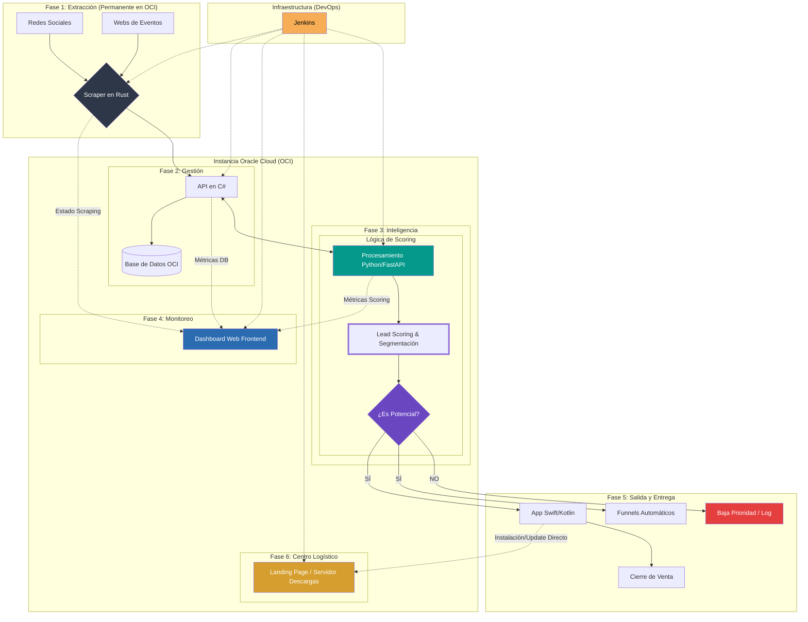

# 🏇 Proyecto: EquineLead (NoCountry S02-26-48)

> **Visión General** 
> **EquineLead** es un motor de crecimiento (Growth Engine) diseñado para la industria ecuestre de lujo. El objetivo es automatizar la captación de clientes potenciales (Leads) para ventas de alto valor ($50k por caballo, $2k por equipamiento) usando técnicas de Data Science y automatización.

## 🏗️ Estructura del Sistema (Workflow)

Este diagrama representa cómo viaja la información desde internet hasta la venta final.

## 🛠️ Stack Tecnológico: ¿Cómo se implementa?

### Explicación del flujo para el equipo:

1.  **El rastreador | Captación (Rust - Jorge):** El sistema realiza un rastreo web (scraping) masivo buscando perfiles en redes sociales y asistentes a ferias ecuestres. Se utiliza **Rust** por su alta velocidad y eficiencia para procesar grandes volúmenes de datos de internet sin saturar el servidor. Vive permanentemente en la instancia de **OCI**.
    
2.  **El orquestador | Gestión (Isabel / Franklin):** Esta API actúa como el nodo central del sistema. **Isabel** diseña la persistencia y base de datos, mientras **Franklin** define las conexiones e interfaces. Recibe la información "sucia" del Scraper, la limpia y la guarda en la base de datos (OCI).
    
3.  **El cerebro | Inteligencia (FastAPI - Leandro):** Es un servicio especializado que procesa la lógica de **Data Science** de forma independiente. **Leandro** diseña el modelo de lead scoring (Frío/Tibio/Caliente) y genera el dataset sintético.
    
4.  **El Panel de Control | Dashboard (Frontend - Franklin):** Un componente vital para el monitoreo. Es una interfaz web donde el equipo puede verificar en tiempo real el estado del scraping y las métricas de scoring.
    
5.  **La cara al cliente | Entrega (Franklin):** Esta fase solo se activa si el cerebro determina un **SÍ**. El orquestador dispara las notificaciones a la **App móvil** del equipo de ventas.
    
6.  **Centro Logístico | OCI & Distribución (Diego):** Todo el backend vive en **Oracle Cloud**. El servidor funciona además como landing page para descargas directas de las apps móviles.
    
7.  **El supervisor | Automatización (Jenkins - Diego / Junior):** Es el motor que orquestra todo el despliegue técnico desde **OCI**. **Diego** gestiona los pipelines y **Junior** administra la estructura del repositorio.

---