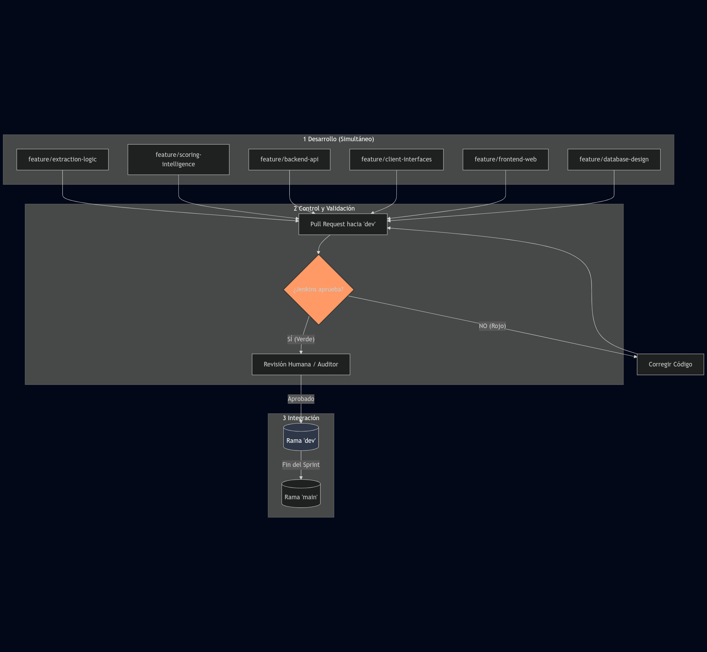

# 🚀 Propuesta de Flujo de Trabajo y Automatización: Jenkins en EquineLead

**EquineLead** es un motor de crecimiento para la industria ecuestre de lujo, cuyo objetivo es captar clientes potenciales de alto valor (ventas de **$50,000 USD** por caballo). Para que un equipo de **varias personas** trabaje en simultáneo con tecnologías variadas como Rust, C#, Swift, Kotlin y Data Science, es vital contar con un sistema de validación automática que asegure la calidad del código.

## 1. ¿Qué es Jenkins?

Jenkins es un **servidor de automatización** que actúa como un "supervisor técnico" constante. Su función es vigilar nuestro repositorio de GitHub y, cada vez que alguien sube un cambio, probarlo automáticamente para asegurar que no rompa el proyecto. **Diego** es el encargado de configurar y mantener esta herramienta para que el flujo de trabajo sea siempre fluido y confiable.

## 2. Visualización del Flujo de Trabajo

Este esquema detalla el camino que recorre el código desde nuestras computadoras hasta la versión final:

### 🔍 Explicación del Diagrama

- **Fase 1 (Desarrollo):** Cada integrante trabaja en su propia "rama" de forma simultánea (Jorge en Rust, Leandro en Python/DS, Franklin en Mobile/API, Isabel en BD).
    
- **Fase 2 (Validación):** Al terminar la tarea, se solicita unir el código mediante un **Pull Request (PR)**. Aquí entra **Jenkins**: el sistema revisa automáticamente si el código funciona.
    
    - Si **Jenkins detecta un error (Rojo)**, el código se devuelve para ser corregido por su autor.
        
    - Si **Jenkins aprueba (Verde)**, el código pasa a la revisión del **Auditor Humano**, quien verifica que la lógica sea correcta. (Nota: Los auditores están siendo elegidos mediante votación lanzada por Franklin).
        
- **Fase 3 (Integración):** Una vez aprobado por el robot y por el humano, el código se une a `dev` y finalmente a `main`.
    

---

## 3. Manejo de Errores y Responsabilidades

Es importante tener claro qué sucede cuando Jenkins detecta un fallo:

- **¿Quién lo soluciona?**: El responsable de corregir el error es **siempre el programador que subió el código**. Si el error ocurre en el Scraper, el encargado de Rust lo soluciona; si ocurre en la lógica de datos, su autor lo revisa.
    
- **¿Cómo se avisa?**: La alerta es **automática**. GitHub marcará el Pull Request con una "X" roja y Jenkins enviará una notificación (que podemos configurar para Discord o correo) directamente al autor del cambio.
    
- **Errores Comunes que Jenkins detectaría**:
    
    - **Errores de Sintaxis**: Olvidar un punto y coma, una llave o errores de escritura en el código.
        
    - **Librerías Faltantes**: Cuando el código depende de una herramienta que no está instalada en el sistema.
        
    - **Fallos de Compilación**: Cuando el código de Rust o C# no logra "armarse" correctamente.
        

## 4. Diferencia: Jenkins vs. Auditor de PR (Humano)

Aunque ambos cuidan la calidad, cumplen funciones distintas que no debemos confundir:

 |**Característica**|**Jenkins (Automatización)**|**Encargado de PR (Auditor Humano)**|
 |---|---|---|
 |**Naturaleza**|Software / Robot que trabaja 24/7.|Integrante del equipo (Persona).|
 |**Revisión**|**Técnica**: ¿El código funciona y compila?.|**Lógica**: ¿La solución es buena para el negocio?.|
|**Orden**|Es el **Primer Filtro** (Inmediato).|Es el **Segundo Filtro** (Manual).|

## 📑 Conclusión para el equipo

Implementar este flujo nos permitirá trabajar con la seguridad de que nuestra rama principal de desarrollo (`dev`) nunca se romperá. Al gestionar Jenkins, mi labor será configurar estas reglas para que todos podamos avanzar más rápido y con menos errores manuales.
