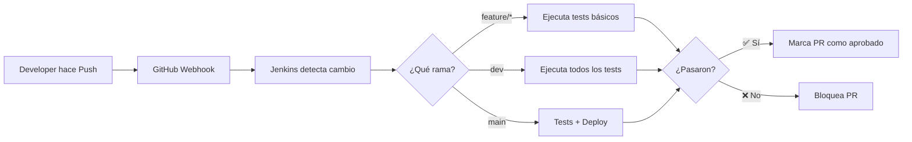

# 05. 🔧 EquineLead - Jenkins CI/CD Pipelines

> 📍 **Navegación**: [🏠 Inicio](../../README.md) → [CI/CD](../README.md) → Jenkins Pipelines
> 📖 **Guía Rápida**: [Configuración Paso a Paso (Unlock, Secrets, Webhooks)](./CONFIGURACION_PASO_A_PASO.md)

> **Analogía**: Jenkins es el **director del taller mecánico** de EquineLead. Coordina a todos los mecánicos automáticos (scripts), decide cuándo inspeccionar el auto (ejecutar tests), y asegura que solo vehículos en perfecto estado salgan a la pista (producción).

---

## 🎯 **Propósito**

Esta carpeta contiene los Jenkinsfiles que definen los pipelines de CI/CD para el proyecto EquineLead. Cada Jenkinsfile es como un "manual de procedimientos" que Jenkins sigue automáticamente.

---

## 📁 **Jenkinsfiles Disponibles**

```
jenkins/
├── Jenkinsfile                   # 🚀 Pipeline maestro (ejecuta todos)
├── Jenkinsfile.backend           # 🔧 Pipeline para Backend C#
├── Jenkinsfile.datascience       # 🧠 Pipeline para Data Science
├── Jenkinsfile.scrapper          # 🦀 Pipeline para Scrapper Rust
├── Jenkinsfile.frontend          # 🎨 Pipeline para Frontend Web
├── Jenkinsfile.mobile-ios        # 📱 Pipeline para iOS (futuro)
├── Jenkinsfile.mobile-android    # 📱 Pipeline para Android (futuro)
└── README.md                     # Este archivo
```

---

## 🚗 **La Analogía del Director de Taller**

| Jenkinsfile | Rol del Director | Qué Coordina |
|-------------|------------------|--------------|
| `Jenkinsfile` | 👨‍💼 Director General | Coordina todos los pipelines |
| `Jenkinsfile.backend` | 🔧 Supervisor del Motor | Inspección del Backend |
| `Jenkinsfile.datascience` | 🧠 Jefe de Electrónica | Inspección de IA/ML |
| `Jenkinsfile.scrapper` | 📡 Coordinador de Sensores | Inspección del Scrapper |
| `Jenkinsfile.frontend` | 🎨 Diseñador Jefe | Inspección de UI |

---

## 🚀 **Cómo Funcionan los Pipelines**

### **Pipeline Maestro** (`Jenkinsfile`)

Este es el pipeline principal que ejecuta todos los demás:

```groovy
pipeline {
    agent any
    
    stages {
        stage('Checkout') {
            // Descarga el código del repositorio
        }
        
        stage('Check Builds') {
            // Verifica que todo compile
        }
        
        stage('Run All Tests') {
            parallel {
                // Ejecuta tests en paralelo
                stage('Backend') { ... }
                stage('Data Science') { ... }
                stage('Scrapper') { ... }
                stage('Frontend') { ... }
            }
        }
    }
}
```

**Cuándo se ejecuta**:
- En cada Pull Request
- En cada merge a `dev` o `main`
- Manualmente desde Jenkins

---

### **Pipelines Individuales**

Cada componente tiene su propio pipeline:

#### **Backend C#** (`Jenkinsfile.backend`)

```groovy
stages {
    stage('Build') {
        sh 'dotnet build src/backend-csharp/'
    }
    stage('Test') {
        sh './tests/scripts/run_backend_tests.sh'
    }
}
```

#### **Data Science** (`Jenkinsfile.datascience`)

```groovy
stages {
    stage('Setup') {
        sh 'pip install -r src/data-science/requirements.txt'
    }
    stage('Test') {
        sh './tests/scripts/run_datascience_tests.sh'
    }
}
```

#### **Scrapper Rust** (`Jenkinsfile.scrapper`)

```groovy
stages {
    stage('Build') {
        sh 'cargo build --manifest-path src/scrapper-rust/Cargo.toml'
    }
    stage('Test') {
        sh './tests/scripts/run_scrapper_tests.sh'
    }
}
```

#### **Frontend Web** (`Jenkinsfile.frontend`)

```groovy
stages {
    stage('Install') {
        sh 'npm install --prefix src/frontend-web'
    }
    stage('Build') {
        sh 'npm run build --prefix src/frontend-web'
    }
    stage('Test') {
        sh './tests/scripts/run_frontend_tests.sh'
    }
}
```

---

## 🎓 **Para Principiantes**

### **¿Qué es un Jenkinsfile?**

Un **Jenkinsfile** es un archivo que define un "pipeline" (flujo de trabajo) en Jenkins. Es como una receta que le dice a Jenkins:

1. **Qué hacer** (build, test, deploy)
2. **Cuándo hacerlo** (en cada push, PR, etc.)
3. **Cómo reportar** (éxito, fallo, warnings)

### **Estructura Básica de un Pipeline**

```groovy
pipeline {
    agent any  // ← Dónde ejecutar (cualquier agente disponible)
    
    environment {
        // Variables de entorno
        PROJECT_NAME = 'EquineLead'
    }
    
    stages {
        // Etapas del pipeline
        stage('Build') {
            steps {
                // Comandos a ejecutar
                sh 'npm install'
            }
        }
        
        stage('Test') {
            steps {
                sh 'npm test'
            }
        }
    }
    
    post {
        // Qué hacer después
        success {
            echo '✅ Pipeline exitoso'
        }
        failure {
            echo '❌ Pipeline falló'
        }
    }
}
```

### **Conceptos Clave**

| Concepto | Qué es | Ejemplo |
|----------|--------|---------|
| **Pipeline** | Flujo de trabajo completo | Build → Test → Deploy |
| **Stage** | Etapa del pipeline | "Build", "Test", "Deploy" |
| **Step** | Acción individual | `sh 'npm test'` |
| **Agent** | Dónde se ejecuta | `agent any` |
| **Post** | Acciones finales | Notificaciones, limpieza |

---

## 📊 **Flujo de Trabajo con GitHub**



---

## 🔧 **Configuración de Jenkins**

### **Requisitos Previos**

Para que los Jenkinsfiles funcionen, Jenkins debe tener instalado:

- ✅ **.NET SDK 6.0+** (para Backend C#)
- ✅ **Python 3.8+** (para Data Science)
- ✅ **Rust/Cargo** (para Scrapper)
- ✅ **Node.js 16+** (para Frontend)
- ✅ **Git** (para checkout de código)

### **Plugins de Jenkins Necesarios**

```
- Pipeline Plugin
- Git Plugin
- GitHub Plugin
- Docker Pipeline (futuro)
- Blue Ocean (opcional, para UI mejorada)
```

### **Configurar un Job en Jenkins**

1. **Crear nuevo Pipeline Job**
   - New Item → Pipeline → OK

2. **Configurar GitHub**
   - Build Triggers → GitHub hook trigger

3. **Definir Pipeline**
   - Pipeline → Pipeline script from SCM
   - SCM: Git
   - Repository URL: `https://github.com/tu-org/equine-lead.git`
   - Script Path: `ci-cd/jenkins/Jenkinsfile`

4. **Guardar y ejecutar**

---

## 🎯 **Estrategia de Testing por Rama**

### **MVP Actual: Opción A (Build + Tests)**

| Rama | Trigger | Jenkins Ejecuta | Deploy |
|------|---------|-----------------|--------|
| `feature/*` | Push | Build + Tests | ❌ No |
| `dev` | Merge PR | Build + Tests | ❌ No |
| `main` | Merge PR | Build + Tests | ❌ No |

### **Futuro: Opción B (Con Deploy Automático)**

| Rama | Trigger | Jenkins Ejecuta | Deploy |
|------|---------|-----------------|--------|
| `feature/*` | Push | Build + Tests | ❌ No |
| `dev` | Merge PR | Build + Tests | ✅ Staging |
| `main` | Merge PR | Build + Tests + Security | ✅ Producción |

---

## 🐛 **Troubleshooting** {: #-troubleshooting }

### **Error: "sh: command not found"**

**Causa**: La herramienta no está instalada en el agente de Jenkins.

**Solución**: Instalar en el servidor de Jenkins
```bash
# En el servidor de Jenkins
sudo apt-get install dotnet-sdk-6.0 nodejs npm
```

### **Error: "Permission denied"**

**Causa**: Los scripts no tienen permisos de ejecución.

**Solución**: Agregar permisos en el repositorio
```bash
chmod +x tests/scripts/*.sh
git add tests/scripts/*.sh
git commit -m "Add execute permissions to scripts"
```

### **Pipeline falla pero tests pasan localmente**

**Posibles causas**:
- Variables de entorno diferentes
- Rutas relativas vs absolutas
- Dependencias no instaladas en Jenkins

**Solución**: Verificar logs de Jenkins y comparar con ambiente local

---

## 📈 **Mejores Prácticas**

### **1. Mantén los Pipelines Simples**

```groovy
// ✅ BIEN: Delega lógica a scripts
stage('Test') {
    sh './tests/scripts/run_backend_tests.sh'
}

// ❌ MAL: Lógica compleja en Jenkinsfile
stage('Test') {
    sh 'cd src && dotnet restore && dotnet build && cd ../tests && dotnet test'
}
```

### **2. Usa Variables de Entorno**

```groovy
environment {
    PROJECT_NAME = 'EquineLead'
    BUILD_CONFIG = 'Release'
}

stage('Build') {
    sh "dotnet build --configuration ${BUILD_CONFIG}"
}
```

### **3. Maneja Errores Apropiadamente**

```groovy
post {
    success {
        echo '✅ Pipeline exitoso'
        // Notificar al equipo
    }
    failure {
        echo '❌ Pipeline falló'
        // Enviar alerta
    }
    always {
        cleanWs()  // Limpiar workspace
    }
}
```

---

## 🔗 **Integración con GitHub**

### **Configurar Webhook**

1. En GitHub: Settings → Webhooks → Add webhook
2. Payload URL: `http://tu-jenkins.com/github-webhook/`
3. Content type: `application/json`
4. Events: `Push`, `Pull request`

### **Branch Protection Rules**

Configurar en GitHub para requerir que Jenkins pase:

1. Settings → Branches → Add rule
2. Branch name pattern: `dev`, `main`
3. ✅ Require status checks to pass
4. ✅ Require branches to be up to date
5. Select: `continuous-integration/jenkins`

---

## 📚 **Recursos Adicionales**

- [Documentación oficial de Jenkins](https://www.jenkins.io/doc/)
- [Pipeline Syntax Reference](https://www.jenkins.io/doc/book/pipeline/syntax/)
- [Best Practices](https://www.jenkins.io/doc/book/pipeline/pipeline-best-practices/)

---

## 🔗 **Enlaces Relacionados**

- [🏠 **README Principal**](../../README.md) - Visión general del proyecto
- [🏗️ **Infraestructura**](../../infrastructure/README.md) - Arquitectura y deployment
- [🤖 **CI/CD y DevOps**](../README.md) - Guía maestra de automatización
- [🧪 **Infraestructura de Testing**](../../tests/README.md) - Guía completa de tests
- [📜 **Scripts de Automatización**](../../tests/scripts/README.md) - Scripts bash
- [📖 **Backend C# Tests**](../../tests/backend-csharp/README.md)
- [📖 **Data Science Tests**](../../tests/data-science/README.md)
- [📖 **Scrapper Rust Tests**](../../tests/scrapper-rust/README.md)
- [📖 **Frontend Web Tests**](../../tests/frontend-web/README.md)

---

> **Recuerda**: Un buen director de taller asegura que solo autos perfectos salgan a la pista. ¡Configura Jenkins correctamente! 🤖✨
