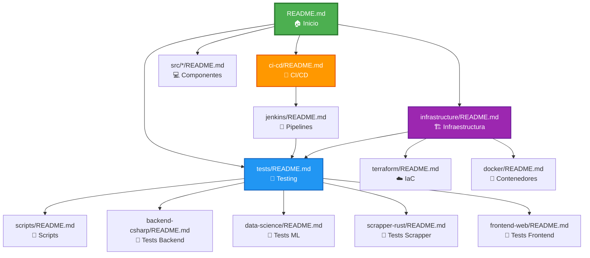

# 07. 📊 EquineLead - Mapa de Flujo de Documentación

> **Propósito**: Este diagrama muestra cómo se conectan todos los READMEs del proyecto y el orden recomendado de lectura para nuevos developers.

---

## 🗺️ **Mapa de Navegación de Documentación**



---

## 📚 **Orden de Lectura Recomendado**

### **Para Nuevos Developers**

```
1. [01. README.md (Raíz)](../README.md)
   ↓ "¿Qué es EquineLead?"
   ↓ "¿Cómo está organizado?"
   
2. [02. infrastructure/README.md](../infrastructure/README.md)
   ↓ "¿Dónde corre todo?"
   ↓ "¿Cómo funciona el deployment?"
   
3. [03. tests/README.md](../tests/README.md)
   ↓ "¿Cómo pruebo mi código?"
   ↓ "¿Qué tests debo escribir?"
   
4. [05. ci-cd/jenkins/README.md](../ci-cd/jenkins/README.md)
   ↓ "¿Cómo funciona la automatización?"
   ↓ "¿Qué hace Jenkins?"
   
5. [03.1. tests/scripts/README.md](../tests/scripts/README.md)
   ↓ "¿Cómo ejecuto tests localmente?"
   ↓ "¿Qué scripts existen?"
   
6. `src/<tu-componente>/README.md`
   ↓ "Detalles específicos de tu área"
```

---

## 🔗 **Conexiones Entre Documentos**

### **[README.md](../README.md) (Hub Central)**
- **Enlaza a**: Todos los READMEs principales
- **Es enlazado por**: [tests/README.md](../tests/README.md), [ci-cd/README.md](../ci-cd/README.md), [infrastructure/README.md](../infrastructure/README.md), [ci-cd/jenkins/README.md](../ci-cd/jenkins/README.md), [tests/scripts/README.md](../tests/scripts/README.md)

### **[infrastructure/README.md](../infrastructure/README.md)**
- **Enlaza a**: [tests/README.md](../tests/README.md), [ci-cd/README.md](../ci-cd/README.md), [ci-cd/jenkins/README.md](../ci-cd/jenkins/README.md)
- **Es enlazado por**: [README.md](../README.md), [ci-cd/README.md](../ci-cd/README.md), [tests/README.md](../tests/README.md)

### **[tests/README.md](../tests/README.md)**
- **Enlaza a**: [scripts/README.md](../tests/scripts/README.md), [ci-cd/jenkins/README.md](../ci-cd/jenkins/README.md), todos los tests/*/README.md
- **Es enlazado por**: [README.md](../README.md), [infrastructure/README.md](../infrastructure/README.md), [ci-cd/README.md](../ci-cd/README.md)

### **[ci-cd/README.md](../ci-cd/README.md)**
- **Enlaza a**: [tests/README.md](../tests/README.md), [jenkins/README.md](../ci-cd/jenkins/README.md), [infrastructure/README.md](../infrastructure/README.md)
- **Es enlazado por**: [README.md](../README.md), [infrastructure/README.md](../infrastructure/README.md)

### **[ci-cd/jenkins/README.md](../ci-cd/jenkins/README.md)**
- **Enlaza a**: [tests/README.md](../tests/README.md), [tests/scripts/README.md](../tests/scripts/README.md), todos los tests/*/README.md
- **Es enlazado por**: [README.md](../README.md), [ci-cd/README.md](../ci-cd/README.md), [infrastructure/README.md](../infrastructure/README.md), [tests/README.md](../tests/README.md)

### **[tests/scripts/README.md](../tests/scripts/README.md)**
- **Enlaza a**: [tests/README.md](../tests/README.md), [ci-cd/jenkins/README.md](../ci-cd/jenkins/README.md)
- **Es enlazado por**: [tests/README.md](../tests/README.md), [ci-cd/jenkins/README.md](../ci-cd/jenkins/README.md)

---

## 🎯 **Navegación por Objetivo**

### **"Quiero entender el proyecto"**
```
README.md → infrastructure/README.md → DEVELOPER_ONBOARDING.md
```

### **"Quiero configurar mi entorno"**
```
README.md → tests/README.md → tests/scripts/README.md
```

### **"Quiero entender CI/CD"**
```
README.md → ci-cd/README.md → ci-cd/jenkins/README.md → tests/README.md
```

### **"Quiero escribir tests"**
```
README.md → tests/README.md → tests/<componente>/README.md
```

### **"Quiero entender deployment"**
```
README.md → infrastructure/README.md → ci-cd/jenkins/README.md
```

---

## 📍 **Breadcrumbs en Cada README**

Todos los READMEs ahora incluyen breadcrumbs de navegación:

```markdown
> 📍 **Navegación**: [🏠 Inicio](../README.md) → [Sección] → Subsección
```

**Ejemplos:**
- `tests/README.md`: `[🏠 Inicio](../README.md) → Testing Infrastructure`
- `ci-cd/jenkins/README.md`: `🏠 Inicio (../../README.md) → CI/CD (../README.md) → Jenkins Pipelines`
- `tests/scripts/README.md`: `🏠 Inicio (../../README.md) → Testing (../README.md) → Scripts`

---

## 🏁 **Analogía Consistente**

Todos los READMEs ahora usan la analogía del **auto de carreras**:

- **EquineLead** = Auto de carreras de alta tecnología
- **Testing** = Inspección técnica antes de salir a la pista
- **Jenkins** = Director del taller mecánico
- **Scripts** = Mecánicos automáticos especializados
- **Componentes** = Partes del auto (motor, cerebro, sensores, tablero)
- **Producción** = La pista de carreras

---

## 📊 **Matriz de Coherencia**

| README | Breadcrumb | Analogía | Enlaces Salida | Enlaces Entrada |
|--------|-----------|----------|----------------|-----------------|
| `README.md` | ❌ No (es raíz) | ✅ Auto de carreras | 10+ | Todos |
| `infrastructure/README.md` | ✅ Sí | ✅ Garaje/Taller | 7 | 4 |
| `tests/README.md` | ✅ Sí | ✅ Inspección técnica | 8 | 5 |
| `ci-cd/README.md` | ✅ Sí | ✅ Mecánico jefe | 6 | 3 |
| `ci-cd/jenkins/README.md` | ✅ Sí | ✅ Director taller | 10 | 5 |
| `tests/scripts/README.md` | ✅ Sí | ✅ Mecánicos automáticos | 9 | 3 |

---

## ✅ **Mejoras Implementadas**

### **Prioridad Alta**
- [x] Actualizado `README.md` como hub central
- [x] Agregada sección "Testing Infrastructure" en `ci-cd/README.md`
- [x] Agregado enlace a `tests/README.md` en `infrastructure/README.md`

### **Prioridad Media**
- [x] Agregados breadcrumbs en todos los READMEs principales
- [x] Unificada analogía del auto de carreras

### **Prioridad Baja**
- [x] Creado `DEVELOPER_ONBOARDING.md`
- [x] Creado este diagrama de flujo de documentación

---

## 🔗 **Enlaces Rápidos**

- [🏠 README Principal](../README.md)
- [🏗️ Infraestructura](../infrastructure/README.md)
- [🧪 Testing](../tests/README.md)
- [🤖 CI/CD](../ci-cd/README.md)
- [🔧 Jenkins](../ci-cd/jenkins/README.md)
- [� Scripts de Testing](../tests/scripts/README.md)
- [🎓 Developer Onboarding](./DEVELOPER_ONBOARDING.md)

---

> **Última actualización**: 2026-02-12  
> **Estado**: Documentación completamente integrada ✅
