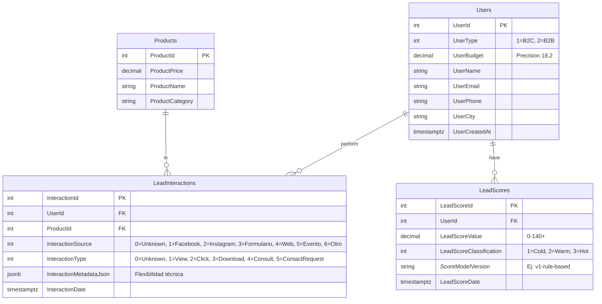

# 🗄️ Especificación Técnica: Base de Datos PostgreSQL v2 (MVP)
**Estatus:** Finalizado / Auditado  
**Responsable Original:** Isabel (Backend Lead)  
**Ref. de Proyecto:** [Issue #12 - Implementación Backend](...)
**Ref. de Implementación:** [Backend C# README](../../src/backend-csharp/README.md)

---

## 📊 Arquitectura de Datos (Mermaid)
> *(Nivel dummie: Este es el plano que muestra cómo se conectan los cables. Los "Users" son el centro, y de ellos nacen sus interacciones y sus puntajes).*

---

## 🛠️ Diccionario de Datos (Nivel Dummie)

### 1. **Tabla: Users** (Los Clientes)
- **UserId**: Tu número de carnet único.
- **UserType**: ¿Es una persona (B2C) o una empresa (B2B)?
- **UserCreatedAt**: Momento exacto en que entró al sistema.

### 2. **Tabla: Products** (Lo que vendemos)
- **ProductPrice**: Precio con centavos exactos.
- **ProductCategory**: Etiquetas como "Caballos", "Eventos", "Servicios".

### 3. **Tabla: LeadInteractions** (La Actividad)
- **InteractionSource**: Origen del lead. Valores: Facebook (1), Instagram (2), Formulario (3), Web (4), Evento (5), Otro (6).
- **InteractionType**: Tipo de acción. Valores: View (1), Click (2), Download (3), Consult (4), ContactRequest (5).
- **InteractionMetadataJson**: Una "maleta" donde podemos meter detalles extra (ej: User-Agent, Referrer) sin romper nada.

### 4. **Tabla: LeadScores** (El Termómetro)
- **LeadScoreValue**: El puntaje calculado por el motor de IA.
- **LeadScoreClassification**: Categoría del lead. Valores: Cold (1), Warm (2), Hot (3).
- **ScoreModelVersion**: Versión del algoritmo/modelo utilizado (ej: "v1-rule-based").

---

## 💡 Notas de Implementación (Isabel)
- **Uso de INT**: Se decidió usar números (`INT`) en lugar de texto para que el sistema sea más rápido.
- **Mapeo de Enums (C#)**: El backend utiliza un convertidor (`JsonStringEnumConverter`) que permite enviar el nombre en texto (ej: "Facebook") en el JSON, el cual se transforma automáticamente al número correspondiente (1) en la base de datos.
- **Presupuesto (UserBudget)**: Solo guardamos el **último** presupuesto proporcionado. No guardamos el historial para mantener el MVP simple y veloz.
- **Cálculo de Score**: El valor se recalcula con cada nueva interacción para tener siempre el dato más fresco posible, persistiendo el resultado en la tabla `LeadScores`.

---
**Sincronizado con:** Issue #11 y #12.

