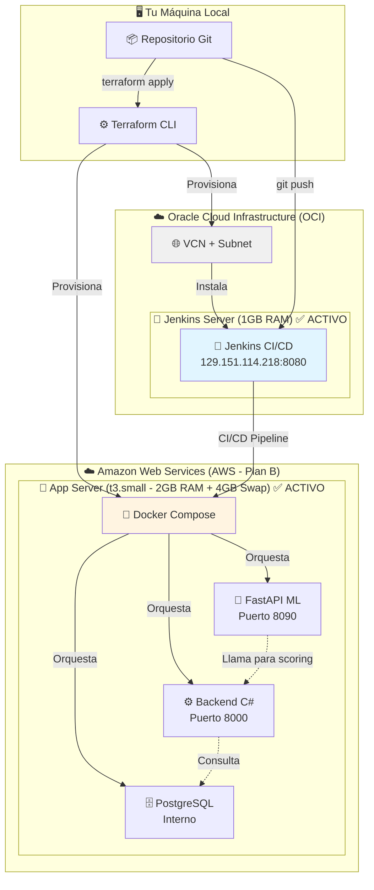
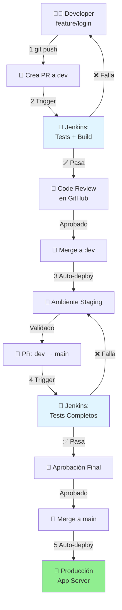

# 02. 🏗️ EquineLead - Infraestructura

> 📍 **Navegación**: [🏠 Inicio](../README.md) → Infraestructura

> **🏁 Analogía**: Esta carpeta es el **garaje y taller mecánico** donde se construye y mantiene nuestro auto de carreras (EquineLead). Aquí definimos las especificaciones del vehículo (Terraform) y cómo empaquetar cada componente para el transporte (Docker).

Este directorio contiene toda la configuración de infraestructura del proyecto EquineLead, organizada en dos grandes áreas: **provisión de recursos en la nube** (Terraform) y **configuración de servicios** (Docker).

---

## 📊 Arquitectura de Infraestructura (Hito 1 Activa)

> [!IMPORTANT]
> La infraestructura usa **dos nubes diferentes**: Jenkins en **OCI** y el App Server en **AWS** (Plan B activo).



## 📁 Organización de Carpetas

### **Terraform (IaC)**
**Propósito:** Infrastructure as Code (IaC) para provisionar recursos en Oracle Cloud Infrastructure.

**Contenido:**
- Código Terraform para crear las dos instancias (Jenkins 1GB + App Server 6GB)
- Configuración de red (VCN, Internet Gateway, Security Lists, Subnet)
- Módulos reutilizables para cada componente
- Scripts de instalación automatizada (`userdata.sh`)

**Se ejecuta desde:** Tu máquina local  
**Resultado:** Infraestructura lista en OCI

📖 [Ver documentación detallada de Terraform](./terraform/README.md)

---

### **Docker (Contenedores)**
**Propósito:** Configuración de contenedores para la **Instancia 2 (App Server 6GB)**.

**Contenido:**
- `docker-compose.yml` - Orquesta todos los servicios (Backend, FastAPI, Scrapper, DB)
- Configuraciones de red entre contenedores
- Variables de entorno
- Dockerfiles personalizados (si se necesitan)

**Se ejecuta en:** Instancia App Server (6GB)  
**Resultado:** Todos los servicios corriendo en contenedores

📖 [Ver documentación de Docker](./docker/README.md)

---

## 🔄 Flujo de Trabajo Completo

### **Provisión Inicial**

```bash
# Desde tu máquina local
cd infrastructure/terraform
terraform init
terraform plan
terraform apply
```

**Resultado:**
- ✅ Instancia Jenkins (1GB) creada y configurada
- ✅ Instancia App Server (6GB) creada
- ✅ Red configurada (VCN, Security Lists)
- ✅ Jenkins instalado con Docker

---

### **Despliegue de Servicios**

```bash
# Conectarse a la Instancia App Server
ssh ubuntu@<APP_SERVER_IP>

# Clonar el repositorio
git clone <REPO_URL>
cd equine-lead/infrastructure/docker

# Levantar todos los servicios
docker-compose up -d
```

**Resultado:**
- ✅ Backend C# corriendo en puerto 8000
- ✅ FastAPI corriendo en puerto 8090 (Evita conflicto con Jenkins)
- ✅ Scrapper ejecutándose
- ✅ Base de datos PostgreSQL activa

---

### **CI/CD Automatizado con Pull Requests**

#### 📊 Flujo de Desarrollo con PRs



#### 🔄 Proceso Detallado

**Paso 1: Developer trabaja en feature branch**
```bash
git checkout -b feature/branch-name
# ... desarrollo ...
git push origin feature/branch-name
```

**Paso 2: Pull Request hacia `dev`**

1. Developer crea PR en GitHub: `feature/branch-name` → `dev`
2. **Jenkins automáticamente:**<br>
    - ✅ Ejecuta `./tests/scripts/run_all_tests.sh` - Script maestro que coordina todos los tests.
    - ✅ Ejecuta tests unitarios - Valida que el código no rompa funcionalidades existentes.
    - ✅ Verifica linting - Asegura que el código cumple con estándares de estilo.
    - ✅ Construye la aplicación - Comprueba que el código compila sin errores.
    - ✅ Reporta resultados en el PR - Muestra el estado de las validaciones en GitHub.
3. **Si Jenkins pasa ✅:**
    - **Code Review en GitHub:** Otros developers revisan el código en la interfaz del PR.
    - Dejan comentarios, aprueban o solicitan cambios.
    - Cuando hay suficientes aprobaciones → Merge a `dev`.
4. **Si Jenkins falla ❌:**
    - El PR queda bloqueado.
    - Developer corrige errores y hace push nuevamente.

📖 **Ver detalles de tests**: [tests/README.md](../tests/README.md)

**Paso 3: Despliegue automático a Staging**

- Al hacer merge a `dev`, Jenkins automáticamente despliega en ambiente de pruebas.
- Actualiza el entorno de staging con los últimos cambios.
- El equipo valida la funcionalidad.
- Realiza pruebas manuales y de integración en un ambiente similar a producción.

**Paso 4: Pull Request hacia `main` (Producción)**

1. Cuando `dev` está estable, se crea PR: `dev` → `main`.
2. **Jenkins ejecuta suite completa:**
    - ✅ Tests unitarios + integración - Verifica funcionalidad individual y comunicación entre componentes.
    - ✅ Security scans - Detecta vulnerabilidades y problemas de seguridad en el código.
    - ✅ Performance tests - Evalúa tiempos de respuesta y uso de recursos bajo carga.
3. **Aprobación final del equipo en GitHub** - Revisión crítica antes de afectar producción.
4. Merge a `main` → Jenkins despliega en **producción** (App Server 6GB).
    - Actualiza la aplicación en el servidor de producción.

#### ⚙️ Configuración de Jenkins por Rama

| Rama | Trigger | Jenkins Ejecuta | Deploy Automático |
|------|---------|-----------------|-------------------|
| `feature/*` | Push | Tests + Build | ❌ No |
| `dev` | Merge PR | Tests + Deploy | ✅ Staging |
| `main` | Merge PR | Tests + Security + Deploy | ✅ Producción |

#### 📝 Aclaración: "Equipo revisa código"

Cuando decimos **"equipo revisa código"**, nos referimos al proceso de **Code Review en GitHub**:
- Los developers abren el Pull Request en GitHub
- Otros miembros del equipo revisan los cambios directamente en la interfaz del PR
- Dejan comentarios, sugerencias o aprueban
- Solo después de las aprobaciones necesarias se hace el merge

**Jenkins NO reemplaza el Code Review**, solo automatiza las pruebas técnicas.

---

## 🎯 Relación con `ci-cd/jenkins/`

La carpeta [`/ci-cd/jenkins/`](../ci-cd/jenkins/) en la raíz del proyecto contiene:
- **Jenkinsfiles** - Pipelines de CI/CD para cada componente
- **Scripts de build** - Automatización de construcción
- **Configuraciones de jobs** - Definición de tareas

**Flujo:**
```
Código en /ci-cd/jenkins/ → Jenkins lee y ejecuta → Despliega en App Server
```

---

## 📋 Recursos Activos

### 🔵 Oracle Cloud Infrastructure (OCI)
| Recurso | Descripción | IP / URL | Estado |
|---------|-------------|----------|--------|
| **VCN + Subnet** | Red virtual + subred pública | — | ✅ Activo |
| **Internet Gateway** | Salida a internet | — | ✅ Activo |
| **Security List** | Firewall (22, 8080, 3000, 8000) | — | ✅ Activo |
| **Jenkins Instance** | CI/CD Server (1GB RAM, OCI VM.Standard.E2.1.Micro) | `129.151.114.218` / [Jenkins UI](http://129.151.114.218:8080) | ✅ Activo |

### 🟠 Amazon Web Services (AWS — Plan B)
| Recurso | Descripción | IP / URL | Estado |
|---------|-------------|----------|--------|
| **VPC + Subnet** | Red virtual + subred pública | — | ✅ Activo |
| **Security Group** | Puertos: 22, 80, 8000, 8080, 3005 | — | ✅ Activo |
| **App Server** | `t3.small` (2GB RAM + 4GB Swap, Ubuntu 22.04, 30GB disco) | `44.202.43.214` | ✅ Activo |

> **Nota**: La instancia App Server de 6GB en OCI fue descartada. El **Plan B en AWS** (`t3.small`) es la infraestructura de App Server activa.

---

## 🔐 Seguridad

- **Credenciales:** Nunca subir `terraform.tfvars` ni archivos `.pem` al repositorio
- **Firewall:** Control de acceso mediante OCI Security Lists
- **SSH:** Acceso solo con llaves privadas
- **Secrets:** Variables sensibles gestionadas por Jenkins

---

## 👥 Responsables

- **Infraestructura (Terraform):** Diego
- **Jenkins (CI/CD):** Diego
- **Docker Compose:** Equipo de desarrollo
- **Coordinación:** Todos los equipos

---

## 📚 Documentación Relacionada

- [🏠 **README Principal**](../README.md) - Visión general del proyecto
- [🧪 **Infraestructura de Testing**](../tests/README.md) - Guía completa de tests
- [📜 **Scripts de Testing**](../tests/scripts/README.md) - Scripts de automatización
- [🤖 **CI/CD y DevOps**](../ci-cd/README.md) - Guía maestra de automatización
- [🔧 **Jenkins Pipelines**](../ci-cd/jenkins/README.md) - Configuración de pipelines
- [📖 **Guía Completa de Terraform**](./terraform/docs/Gestión%20de%20Infraestructura%20-%20Terraform.md)
- [📖 **Módulo Jenkins**](./terraform/modules/jenkins/README.md)

---

> **Nota:** Este es un proyecto en desarrollo activo. La Instancia App Server se implementará una vez que los equipos definan sus requisitos de Docker.
