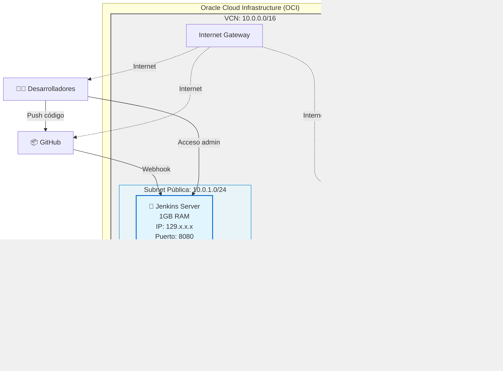
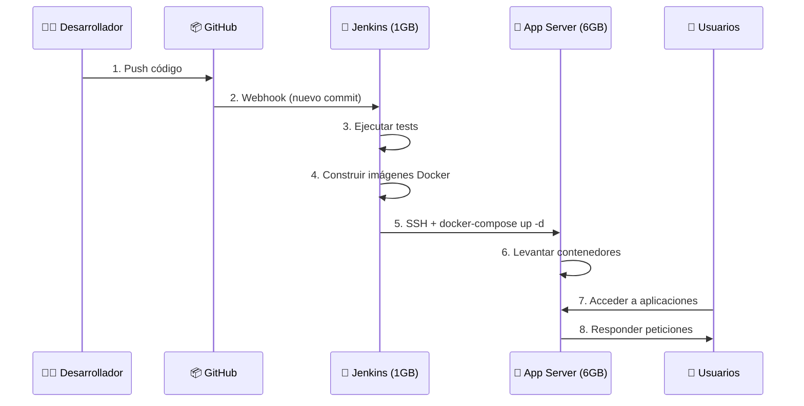
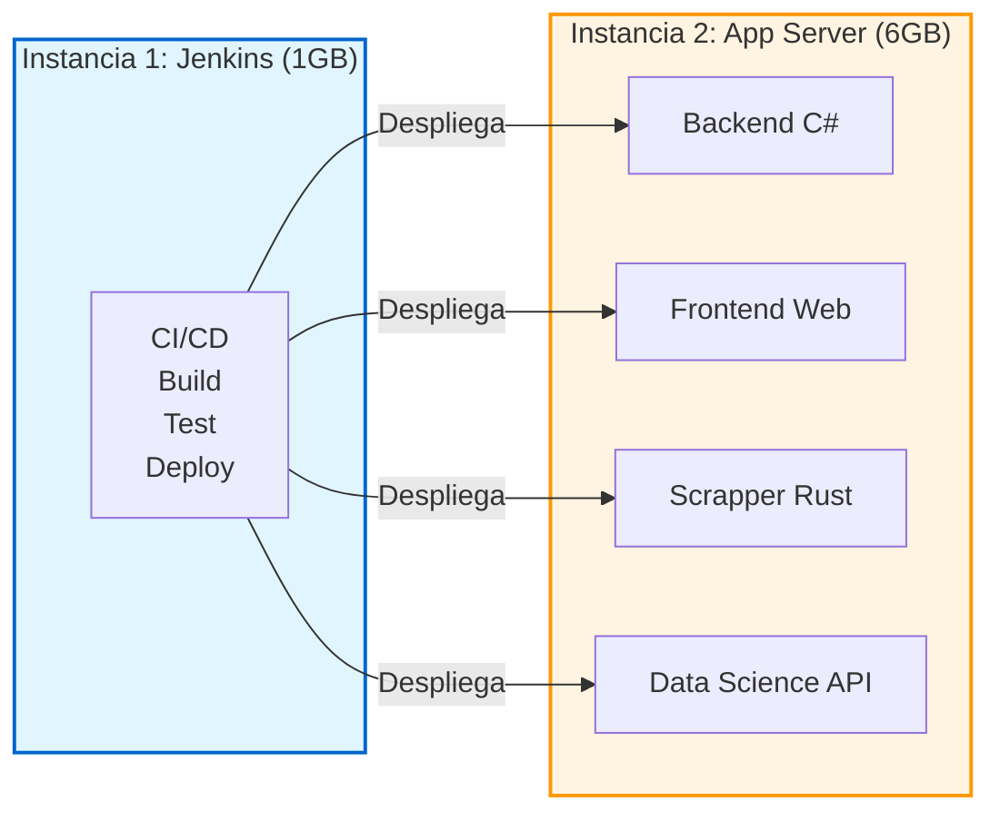
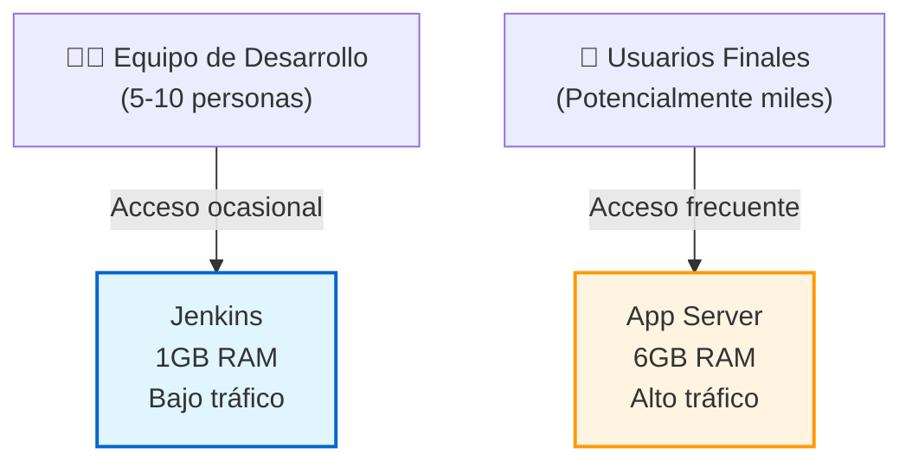
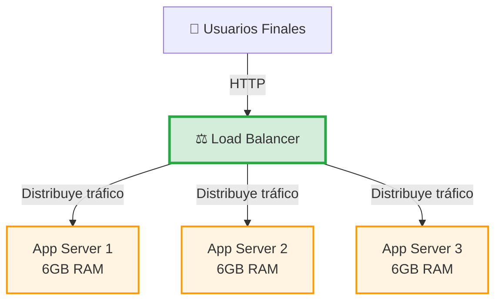
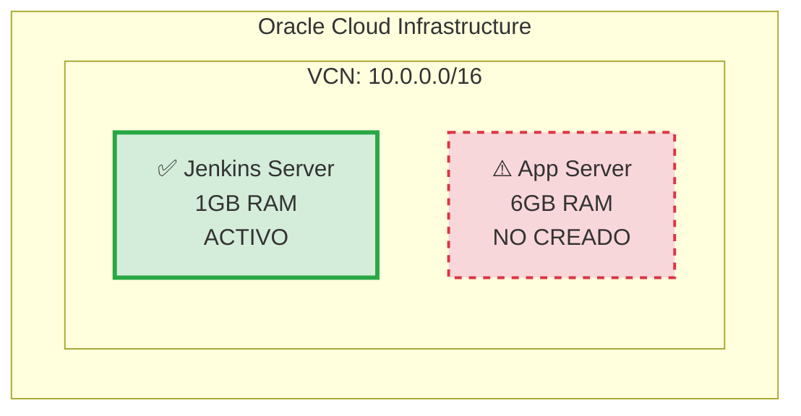
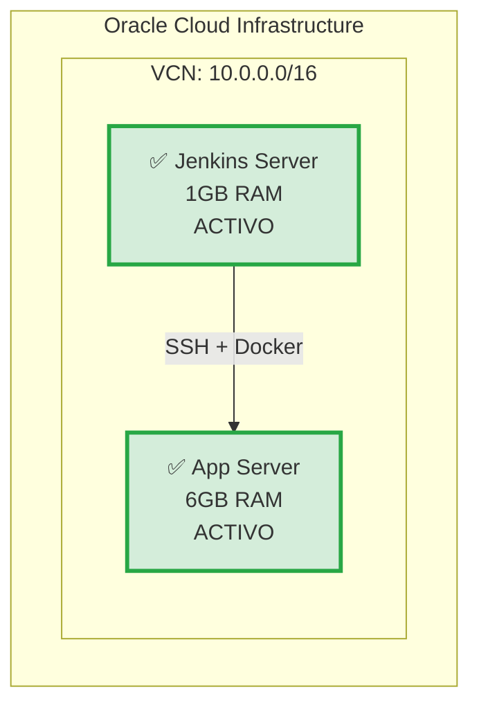
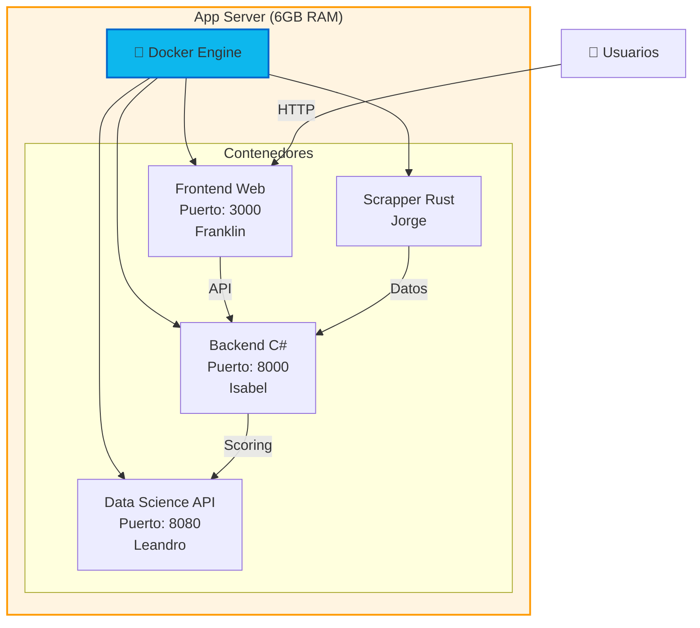
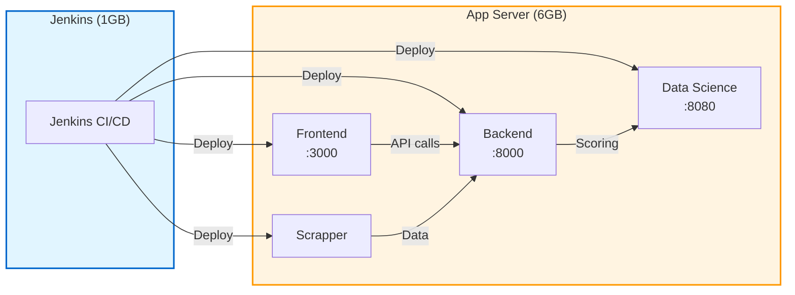

# 📚 Guía Completa de Terraform para EquineLead (Nivel Dummie)

Esta guía explica **absolutamente todo** sobre la infraestructura de Terraform del proyecto EquineLead, paso a paso, para que cualquier persona pueda entender qué hace cada archivo y qué sucede en cada etapa.

---

## 📁 Estructura Completa de Carpetas y Archivos

```
infrastructure/terraform/
├── .gitignore                    # Protege archivos sensibles
├── .terraform/                   # Dependencias del provider (generado automáticamente)
├── .terraform.lock.hcl           # Versiones bloqueadas de providers (generado automáticamente)
│
├── main.tf                       # ORQUESTADOR PRINCIPAL
├── provider.tf                   # Configuración de conexión con OCI
├── variables.tf                  # Definición de variables globales
├── terraform.tfvars              # Valores reales de variables (GITIGNORED)
├── network.tf                    # Configuración de red (VCN, Subnet, etc.)
├── datasources.tf                # Búsqueda dinámica de recursos en OCI
├── outputs.tf                    # Información que Terraform muestra al finalizar
├── README.md                     # Documentación general del proyecto
│
├── compute.tf                    # (Archivo legacy - puede ser removido)
├── cloud-init.yaml               # (Archivo legacy - puede ser removido)
├── userdata.sh                   # (Archivo legacy - puede ser removido)
├── deploy.sh                     # (Script legacy - puede ser removido)
│
├── terraform.tfstate             # Estado actual de la infraestructura (GITIGNORED)
├── terraform.tfstate.backup      # Backup del estado anterior (GITIGNORED)
│
├── modules/                      # Módulos reutilizables
│   ├── jenkins/                  # Módulo para el servidor Jenkins
│   │   ├── main.tf               # Define la instancia de Jenkins
│   │   ├── variables.tf          # Variables del módulo
│   │   ├── outputs.tf            # Outputs del módulo
│   │   ├── userdata.sh           # Script de instalación automática
│   │   └── README.md             # Documentación del módulo
│   │
│   ├── app-server/               # Módulo para servidor de aplicaciones (pendiente)
│   ├── backend-csharp/           # Módulo para API C# (pendiente)
│   ├── database/                 # Módulo para base de datos (pendiente)
│   ├── scrapper-rust/            # Módulo para scrapper (pendiente)
│   ├── data-science/             # Módulo para API de ML (pendiente)
│   └── frontend-web/             # Módulo para dashboard (pendiente)
│
├── evidence/                     # Logs y evidencias de despliegues
│   ├── README.md
│   ├── .gitkeep
│   └── instalacion_jenkins_*.log # Logs generados automáticamente
│
└── docs/                         # Documentación detallada
    └── guia-completa-terraform.md # Este archivo
```

---

## 🔍 Explicación Detallada de Cada Archivo

### 1. `.gitignore`

**¿Qué es?**  
Un archivo que le dice a Git qué archivos NO debe subir al repositorio.

**¿Por qué existe?**  
Para proteger información sensible como:
- Credenciales de OCI (`terraform.tfvars`)
- Llaves privadas (`*.pem`, `*.key`)
- Estado de la infraestructura (`terraform.tfstate`)

**Contenido:**
```gitignore
# Archivos de credenciales (CRÍTICO)
terraform.tfvars
*.pem
*.key
*.log
!/evidence/instalacion_completa.log

# Archivos de estado y configuración de Terraform
.terraform/
.terraform.lock.hcl
terraform.tfstate
terraform.tfstate.backup

# Archivos temporales del sistema
.DS_Store
Thumbs.db
```

---

### 2. `provider.tf`

**¿Qué es?**  
El archivo que configura la conexión entre Terraform y Oracle Cloud Infrastructure (OCI).

**¿Qué hace?**
1. Le dice a Terraform qué "proveedor" usar (en este caso, OCI)
2. Configura las credenciales para autenticarse con OCI

**Contenido explicado:**
```hcl
terraform {
  required_providers {
    oci = {
      source  = "oracle/oci"      # Proveedor oficial de Oracle
      version = ">= 4.0.0"        # Versión mínima requerida
    }
  }
}

provider "oci" {
  tenancy_ocid     = var.tenancy_ocid      # ID de tu cuenta de OCI
  user_ocid        = var.user_ocid         # ID de tu usuario
  fingerprint      = var.fingerprint       # Huella digital de tu llave API
  private_key_path = var.private_key_path  # Ruta a tu llave privada .pem
  region           = var.region            # Región donde crear recursos (ej: sa-santiago-1)
}
```

**¿Qué sucede cuando Terraform lee este archivo?**
1. Terraform descarga el plugin de OCI (si no existe)
2. Lee las credenciales de `terraform.tfvars`
3. Establece una conexión segura con tu cuenta de OCI

---

### 3. `variables.tf`

**¿Qué es?**  
El archivo que define las "variables" (valores que pueden cambiar) que usa Terraform.

**¿Por qué usar variables?**  
Para no escribir valores directamente en el código. Así puedes cambiar configuraciones sin modificar archivos `.tf`.

**Tipos de variables:**

#### Variables de Autenticación (sin valor por defecto)
```hcl
variable "tenancy_ocid" {}       # Se debe proporcionar en terraform.tfvars
variable "user_ocid" {}
variable "fingerprint" {}
variable "private_key_path" {}
variable "region" {}
variable "compartment_ocid" {}
variable "ssh_public_key" {}
```

#### Variables con Valores por Defecto
```hcl
variable "AD" {
  default = "1"                  # Availability Domain (zona de disponibilidad)
}

variable "image_operating_system" {
  default = "Canonical Ubuntu"   # Sistema operativo a usar
}

variable "image_operating_system_version" {
  default = "24.04"              # Versión de Ubuntu
}

variable "instance_shape" {
  default = "VM.Standard.E2.1.Micro"  # Tipo de instancia (1GB RAM)
}
```

**¿Qué sucede cuando Terraform lee este archivo?**
1. Terraform registra todas las variables disponibles
2. Busca los valores en `terraform.tfvars`
3. Si no encuentra un valor y no hay default, pide al usuario que lo ingrese

---

### 4. `terraform.tfvars`

**¿Qué es?**  
El archivo que contiene los **valores reales** de las variables.

**⚠️ CRÍTICO:** Este archivo está en `.gitignore` porque contiene información sensible.

**Contenido (ejemplo):**
```hcl
# Identificadores de tu cuenta OCI
tenancy_ocid     = "ocid1.tenancy.oc1.."
compartment_ocid = "ocid1.compartment.oc1.."
user_ocid        = "ocid1.user.oc1..."
region           = "sa-santiago-1"

# Autenticación de la API de OCI
fingerprint      = "xx:xxx:xx:xx:xx:xx:xx:xx:xx:xx:xx:xx:xx:xx:xx:xx"
private_key_path = "~/path/to/your/key.pem"

# Llave SSH para acceder a las instancias
ssh_public_key   = "ssh-rsa..."

# Token de GitHub
github_token = "ghp_..."
```

**¿Qué sucede cuando Terraform lee este archivo?**
1. Terraform carga todos los valores
2. Reemplaza las variables en los archivos `.tf` con estos valores
3. Usa estas credenciales para autenticarse con OCI

---

### 5. `network.tf`

**¿Qué es?**  
El archivo que crea la infraestructura de red en OCI.

**¿Qué crea?**
1. **VCN (Virtual Cloud Network)**: Una red privada virtual en OCI
2. **Internet Gateway**: Puerta de salida a internet
3. **Route Table**: Tabla de rutas (cómo llegar a internet)
4. **Security List**: Firewall (qué puertos están abiertos)
5. **Subnet**: Subred donde vivirán las instancias

**Flujo de creación:**

```
1. VCN (Red Virtual)
   ↓
2. Internet Gateway (Salida a internet)
   ↓
3. Route Table (Rutas: "Para ir a internet, usa el Internet Gateway")
   ↓
4. Security List (Firewall: "Permitir SSH (22), Jenkins (8080), etc.")
   ↓
5. Subnet (Subred pública donde se crean las instancias)
```

**Puertos abiertos:**
- **22**: SSH (para conectarse a la instancia)
- **3000**: Frontend (para el dashboard web)
- **8000**: Backend API (para la API C#)
- **8080**: Jenkins / FastAPI (compartido - requiere coordinación)

**¿Qué sucede cuando Terraform aplica este archivo?**
1. Crea la VCN con el CIDR `10.0.0.0/16`
2. Crea el Internet Gateway y lo asocia a la VCN
3. Crea la Route Table con una ruta a `0.0.0.0/0` (todo internet) via Internet Gateway
4. Crea la Security List con reglas de firewall
5. Crea la Subnet `10.0.1.0/24` y la asocia a la Route Table y Security List

---

### 6. `datasources.tf`

**¿Qué es?**  
Un archivo que **busca información** en OCI en lugar de crearla.

**¿Qué busca?**
1. **Availability Domains**: Zonas de disponibilidad en tu región
2. **Imágenes de Ubuntu 24.04**: La imagen del sistema operativo compatible con tu shape

**Contenido explicado:**
```hcl
# Buscar los Availability Domains disponibles
data "oci_identity_availability_domains" "ADs" {
  compartment_id = var.tenancy_ocid
}

# Buscar la imagen de Ubuntu 24.04 compatible con el shape
data "oci_core_images" "compute_images" {
  compartment_id           = var.compartment_ocid
  operating_system         = var.image_operating_system         # "Canonical Ubuntu"
  operating_system_version = var.image_operating_system_version # "24.04"
  shape                    = var.instance_shape                 # "VM.Standard.E2.1.Micro"
  state                    = "AVAILABLE"
  sort_by                  = "TIMECREATED"
  sort_order               = "DESC"
}
```

**¿Qué sucede cuando Terraform lee este archivo?**
1. Terraform consulta la API de OCI
2. Obtiene la lista de Availability Domains en tu región
3. Busca la imagen más reciente de Ubuntu 24.04 compatible con tu shape
4. Guarda estos datos para usarlos en otros archivos

---

### 7. `main.tf`

**¿Qué es?**  
El **orquestador principal** que invoca los módulos.

**¿Qué hace?**  
Llama al módulo de Jenkins y le pasa las variables necesarias.

**Contenido explicado:**
```hcl
module "jenkins" {
  source = "./modules/jenkins"  # Ruta al módulo

  # Variables que el módulo necesita
  compartment_ocid    = var.compartment_ocid
  availability_domain = data.oci_identity_availability_domains.ADs.availability_domains[var.AD - 1]["name"]
  subnet_id           = oci_core_subnet.subnet.id
  image_id            = lookup(data.oci_core_images.compute_images.images[0], "id")
  ssh_public_key      = var.ssh_public_key
  github_token        = var.github_token

  # Configuración de la instancia
  instance_shape   = "VM.Standard.E2.1.Micro"
  memory_gb        = 1
  ocpus            = 1
  boot_volume_size = 50
}
```

**¿Qué sucede cuando Terraform aplica este archivo?**
1. Terraform lee el módulo en `./modules/jenkins/`
2. Pasa todas las variables al módulo
3. El módulo crea la instancia de Jenkins
4. Terraform espera a que el módulo termine

---

### 8. `outputs.tf`

**¿Qué es?**  
El archivo que define qué información mostrar al usuario después de aplicar Terraform.

**¿Qué muestra?**
- IP pública de Jenkins
- URL de acceso a Jenkins
- Comando SSH para conectarse

**Contenido explicado:**
```hcl
output "jenkins_public_ip" {
  value       = module.jenkins.public_ip
  description = "IP pública del servidor Jenkins"
}

output "jenkins_url" {
  value       = module.jenkins.jenkins_url
  description = "URL de acceso a Jenkins"
}

output "jenkins_ssh" {
  value       = module.jenkins.ssh_command
  description = "Comando SSH para conectarse a Jenkins"
}
```

**¿Qué sucede cuando Terraform termina de aplicar?**
1. Terraform muestra estos outputs en la terminal
2. El usuario puede copiar la IP, URL o comando SSH directamente

**Ejemplo de salida:**
```
Outputs:

jenkins_public_ip = "129.80.123.45"
jenkins_url = "http://129.80.123.45:8080"
jenkins_ssh = "ssh -i /path/to/your/key ubuntu@129.80.123.45"
```

---

## 📦 Módulo Jenkins (Detallado)

### `modules/jenkins/main.tf`

**¿Qué hace?**  
Crea la instancia de OCI para Jenkins.

**Recursos que crea:**
```hcl
resource "oci_core_instance" "jenkins_server" {
  # Configuración básica
  availability_domain = var.availability_domain
  compartment_id      = var.compartment_ocid
  display_name        = "equine-lead-jenkins"
  shape               = var.instance_shape

  # Configuración de recursos (RAM, CPUs)
  shape_config {
    memory_in_gbs = var.memory_gb  # 1 GB
    ocpus         = var.ocpus      # 1 OCPU
  }

  # Configuración de red
  create_vnic_details {
    subnet_id        = var.subnet_id
    assign_public_ip = true  # Asignar IP pública
  }

  # Configuración del disco
  source_details {
    source_type             = "image"
    source_id               = var.image_id
    boot_volume_size_in_gbs = var.boot_volume_size  # 50 GB
  }

  # Configuración de acceso y script de instalación
  metadata = {
    ssh_authorized_keys = var.ssh_public_key
    user_data = base64encode(templatefile("${path.module}/userdata.sh", {
      github_token = var.github_token
    }))
  }
}
```

**¿Qué sucede cuando Terraform aplica este módulo?**
1. Terraform envía una solicitud a OCI para crear una instancia
2. OCI asigna recursos (1GB RAM, 1 OCPU, 50GB disco)
3. OCI crea una VNIC (interfaz de red) y asigna una IP pública
4. OCI monta la imagen de Ubuntu 24.04
5. OCI ejecuta el script `userdata.sh` automáticamente al iniciar la instancia

---

### `modules/jenkins/userdata.sh`

**¿Qué es?**  
Un script de Bash que se ejecuta **automáticamente** cuando la instancia arranca por primera vez.

**¿Qué hace?**  
Instala y configura todo el software necesario.

**Flujo de ejecución:**

```
1. Configuración de Logging
   ├── Crea directorio /opt/equine-lead/evidence
   ├── Crea archivo de log con timestamp
   ├── Redirige toda la salida al log
   └── Escribe encabezado con info del sistema
   
2. Actualización del Sistema
   ├── apt-get update
   └── apt-get upgrade
   
3. Instalación de Dependencias Básicas
   ├── curl, wget, git
   ├── gnupg, ca-certificates
   └── software-properties-common
   
4. Instalación de Java (OpenJDK 17)
   ├── apt-get install openjdk-17-jdk
   └── Verificación: java -version
   
5. Instalación de Jenkins
   ├── Agregar llave GPG de Jenkins
   ├── Agregar repositorio de Jenkins
   ├── apt-get install jenkins
   ├── systemctl enable jenkins
   └── systemctl start jenkins
   
6. Instalación de Docker
   ├── Agregar llave GPG de Docker
   ├── Agregar repositorio de Docker
   ├── apt-get install docker-ce
   ├── systemctl enable docker
   ├── systemctl start docker
   ├── usermod -aG docker jenkins (Jenkins puede usar Docker)
   └── usermod -aG docker ubuntu (Usuario ubuntu puede usar Docker)
   
7. Instalación de Docker Compose
   └── apt-get install docker-compose
   
8. Configuración de Git
   ├── git config --global credential.helper store
   └── Crear archivo .git-credentials con token de GitHub
   
9. Configuración de Firewall (UFW)
   ├── ufw allow 22/tcp (SSH)
   ├── ufw allow 8080/tcp (Jenkins)
   └── ufw enable
   
10. Obtener Contraseña Inicial de Jenkins
    ├── Esperar 30 segundos
    ├── Leer /var/lib/jenkins/secrets/initialAdminPassword
    ├── Guardar en /home/ubuntu/jenkins-initial-password.txt
    └── Mostrar en consola
    
11. Resumen Final
    ├── Mostrar software instalado
    ├── Verificar servicios activos
    ├── Mostrar URLs de acceso
    ├── Mostrar contraseña inicial
    └── Cambiar permisos del directorio de evidencias
```

**¿Qué sucede cuando la instancia arranca?**
1. OCI ejecuta este script como usuario `root`
2. Todas las salidas se guardan en `/opt/equine-lead/evidence/instalacion_jenkins_YYYYMMDD_HHMMSS.log`
3. El script instala todo el software (tarda ~5-10 minutos)
4. Al finalizar, Jenkins está corriendo en el puerto 8080
5. El log contiene toda la información de la instalación

**Contenido del log generado:**
```
============================================
INSTALACIÓN DE JENKINS - EQUINELEAD
============================================
Sistema Operativo: Ubuntu 24.04.1 LTS
Kernel: 6.8.0-1018-oracle
Arquitectura: x86_64
Fecha de Inicio: 2026-02-08 01:15:30
Hostname: equine-lead-jenkins
Usuario: root

Obteniendo IP pública...
IP Pública: 129.80.123.45

Componentes a instalar:
  - OpenJDK 17
  - Jenkins (última versión estable)
  - Docker Engine + Docker Compose
  - Git

============================================
INICIO DE LA INSTALACIÓN
============================================

[INFO] Actualizando el sistema...
...
[INFO] Instalando Jenkins...
...
============================================
RESUMEN DE LA INSTALACIÓN
============================================
Fecha de Finalización: 2026-02-08 01:22:15

Software Instalado:
  ✓ Java: openjdk version "17.0.10" 2024-01-16
  ✓ Docker: Docker version 25.0.3, build 4debf41
  ✓ Docker Compose: docker-compose version 1.29.2, build unknown
  ✓ Jenkins: Instalado y corriendo en puerto 8080

Servicios Activos:
  ✓ Jenkins: ACTIVO
  ✓ Docker: ACTIVO

Acceso:
  - Jenkins URL: http://129.80.123.45:8080
  - SSH: ssh ubuntu@129.80.123.45

Contraseña Inicial de Jenkins:
  a1b...

Log de Instalación: /opt/equine-lead/evidence/instalacion_jenkins_yyyy-mm-dd_hh-mm-ss.log
============================================
INSTALACIÓN COMPLETADA EXITOSAMENTE
============================================
```

---

## 🔄 Flujo Completo de Terraform

### Paso 1: `terraform init`

**¿Qué hace?**
1. Lee `provider.tf` para saber qué providers necesita
2. Descarga el plugin de OCI desde el registro de Terraform
3. Lee `main.tf` para identificar los módulos
4. Inicializa los módulos en `modules/jenkins/`
5. Crea el directorio `.terraform/` con las dependencias
6. Crea `.terraform.lock.hcl` con las versiones de los providers

**Salida:**
```
Initializing the backend...
Initializing modules...
- jenkins in modules/jenkins
Initializing provider plugins...
- Installing oracle/oci v8.0.0...
- Installed oracle/oci v8.0.0

Terraform has been successfully initialized!
```

---

### Paso 2: `terraform validate`

**¿Qué hace?**
1. Lee todos los archivos `.tf`
2. Verifica la sintaxis (que no haya errores de escritura)
3. Verifica que las referencias sean correctas (ej: que `var.compartment_ocid` exista)
4. Verifica que los módulos tengan todas las variables requeridas

**Salida:**
```
Success! The configuration is valid.
```

---

### Paso 3: `terraform plan`

**¿Qué hace?**
1. Lee `terraform.tfvars` para obtener los valores de las variables
2. Se conecta a OCI usando las credenciales
3. Consulta el estado actual de la infraestructura
4. Compara el estado actual con el estado deseado (definido en los `.tf`)
5. Genera un plan de ejecución mostrando qué se va a crear, modificar o destruir

**Salida (ejemplo):**
```
Terraform will perform the following actions:

  # module.jenkins.oci_core_instance.jenkins_server will be created
  + resource "oci_core_instance" "jenkins_server" {
      + availability_domain = "AD-1"
      + compartment_id      = "ocid1.compartment.oc1..aaaaaa..."
      + display_name        = "equine-lead-jenkins"
      + id                  = (known after apply)
      + public_ip           = (known after apply)
      + shape               = "VM.Standard.E2.1.Micro"
      ...
    }

  # oci_core_vcn.vcn will be created
  + resource "oci_core_vcn" "vcn" {
      + cidr_block     = "10.0.0.0/16"
      + compartment_id = "ocid1.compartment.oc1..aaaaaa..."
      + display_name   = "vcn-validation-ml"
      ...
    }

Plan: 6 to add, 0 to change, 0 to destroy.
```

---

### Paso 4: `terraform apply`

**¿Qué hace?**
1. Ejecuta el plan generado en `terraform plan`
2. Crea los recursos en el orden correcto:
   - Primero: VCN, Internet Gateway, Route Table, Security List, Subnet
   - Después: Instancia de Jenkins
3. Espera a que cada recurso se cree antes de continuar
4. Guarda el estado final en `terraform.tfstate`
5. Muestra los outputs definidos en `outputs.tf`

**Flujo de creación:**
```
1. Creando VCN...                    [COMPLETADO en 5s]
2. Creando Internet Gateway...       [COMPLETADO en 3s]
3. Creando Route Table...            [COMPLETADO en 2s]
4. Creando Security List...          [COMPLETADO en 2s]
5. Creando Subnet...                 [COMPLETADO en 4s]
6. Creando instancia Jenkins...      [COMPLETADO en 45s]
   ├── Asignando recursos
   ├── Montando imagen Ubuntu 24.04
   ├── Asignando IP pública
   └── Ejecutando userdata.sh
```

**Salida:**
```
Apply complete! Resources: 6 added, 0 changed, 0 destroyed.

Outputs:

jenkins_public_ip = "129.80.123.45"
jenkins_url = "http://129.80.123.45:8080"
jenkins_ssh = "ssh -i /path/to/your/key ubuntu@129.80.123.45"
```

---

## 📊 Archivos de Estado

### `terraform.tfstate`

**¿Qué es?**  
Un archivo JSON que contiene el estado actual de toda la infraestructura.

**¿Qué contiene?**
- IDs de todos los recursos creados
- Configuración actual de cada recurso
- Dependencias entre recursos
- Metadatos (versión de Terraform, versión del provider)

**¿Por qué es importante?**  
Terraform usa este archivo para saber qué recursos ya existen y cuáles necesita crear/modificar/destruir.

**⚠️ CRÍTICO:** Este archivo está en `.gitignore` porque puede contener información sensible.

---

### `terraform.tfstate.backup`

**¿Qué es?**  
Una copia de seguridad del estado anterior.

**¿Cuándo se crea?**  
Cada vez que ejecutas `terraform apply`, Terraform:
1. Guarda el estado actual en `terraform.tfstate.backup`
2. Escribe el nuevo estado en `terraform.tfstate`

**¿Para qué sirve?**  
Si algo sale mal, puedes recuperar el estado anterior.

---

## 🎯 Resumen del Flujo Completo

```
1. Usuario ejecuta: terraform init
   ↓
2. Terraform descarga providers y módulos
   ↓
3. Usuario ejecuta: terraform plan
   ↓
4. Terraform consulta OCI y genera plan
   ↓
5. Usuario revisa el plan
   ↓
6. Usuario ejecuta: terraform apply
   ↓
7. Terraform crea recursos en OCI:
   ├── VCN
   ├── Internet Gateway
   ├── Route Table
   ├── Security List
   ├── Subnet
   └── Instancia Jenkins
   ↓
8. OCI arranca la instancia
   ↓
9. OCI ejecuta userdata.sh
   ↓
10. userdata.sh instala:
    ├── Java
    ├── Jenkins
    ├── Docker
    └── Git
    ↓
11. userdata.sh guarda log en /opt/equine-lead/evidence/
    ↓
12. Terraform muestra outputs:
    ├── IP pública
    ├── URL de Jenkins
    └── Comando SSH
    ↓
13. Usuario accede a Jenkins vía navegador
    ↓
14. Usuario ingresa contraseña inicial
    ↓
15. Jenkins está listo para usar
```

---

## 🔍 Preguntas Frecuentes

### ¿Qué pasa si ejecuto `terraform apply` dos veces?

Terraform compara el estado actual con el deseado. Si no hay cambios, no hace nada:
```
No changes. Your infrastructure matches the configuration.
```

### ¿Cómo destruyo todo?

```bash
terraform destroy
```

Terraform eliminará todos los recursos creados.

### ¿Puedo cambiar la configuración después de crear la instancia?

Sí. Modifica los archivos `.tf` y ejecuta `terraform apply`. Terraform detectará los cambios y los aplicará.

### ¿Qué pasa si pierdo el archivo `terraform.tfstate`?

Terraform no sabrá qué recursos creó. Tendrás que:
1. Importar manualmente los recursos existentes, o
2. Destruir todo y volver a crear

**Por eso es crítico hacer backup del estado.**

### ¿Cómo diagnosticar y ver los logs?

Para verificar el estado de la instalación o diagnosticar fallos, usa los siguientes comandos desde tu máquina local:

```bash
# 1. Ver las últimas 50 líneas del log de instalación
ssh -i ~/.oci/oci_api_key.pem ubuntu@<JENKINS_IP> 'tail -50 /opt/equine-lead/evidence/instalacion_jenkins_*.log'

# 2. Ver el log completo de la instalación
ssh -i ~/.oci/oci_api_key.pem ubuntu@<JENKINS_IP> 'cat /opt/equine-lead/evidence/instalacion_jenkins_*.log'

# 3. Verificar estado de los servicios (Docker y Jenkins)
ssh -i ~/.oci/oci_api_key.pem ubuntu@<JENKINS_IP> 'systemctl status jenkins docker --no-pager'

# 4. Verificación rápida de servicios activos
ssh -i ~/.oci/oci_api_key.pem ubuntu@<JENKINS_IP> 'systemctl is-active jenkins docker'
```

> **Tip:** Puedes obtener `<JENKINS_IP>` ejecutando `terraform output` en la carpeta raíz de terraform.

---

## 🏗️ Arquitectura de Infraestructura: Dos Instancias

### Resumen de Instancias

El proyecto EquineLead utiliza **dos instancias separadas** con funciones completamente diferentes:

| Característica | Instancia 1: Jenkins | Instancia 2: App Server |
|----------------|----------------------|-------------------------|
| **RAM** | 1GB | 6GB |
| **Shape** | VM.Standard.E2.1.Micro | VM.Standard.A1.Flex |
| **Propósito** | CI/CD | Aplicaciones de producción |
| **Software** | Jenkins + Docker + Git | Docker + Contenedores |
| **Usuarios** | Equipo de desarrollo | Clientes finales |
| **Puertos** | 8080 (Jenkins UI) | 3000, 8000, 8080 |
| **Estado** | ✅ Se crea ahora | ⚠️ Pendiente (comentado en código) |

---

### Diagrama de Arquitectura Completa



---

### Flujo de Trabajo entre Instancias



---

### ¿Por Qué NO Necesitas un Load Balancer?

#### Razón 1: Funciones Diferentes

Las dos instancias tienen **propósitos completamente distintos**:



**No son réplicas del mismo servicio**, por lo tanto no necesitan balanceo.

---

#### Razón 2: Tráfico Separado



- **Jenkins**: Solo el equipo de desarrollo accede (bajo tráfico)
- **App Server**: Usuarios finales acceden (alto tráfico)

---

#### ¿Cuándo SÍ Necesitarías un Load Balancer?

Solo si tuvieras **múltiples instancias del MISMO servicio**:



**Esto sería necesario si:**
- Tienes mucho tráfico y una instancia no es suficiente
- Quieres alta disponibilidad (si una falla, las otras siguen)
- Necesitas escalar horizontalmente

---

### Estado Actual vs. Estado Futuro

#### Estado Actual (Después de `terraform apply`)



**Solo se crea Jenkins** porque:
- Es lo que necesitas ahora para empezar con CI/CD
- Los equipos aún no han definido sus aplicaciones
- El módulo `app-server` está comentado en `main.tf`

---

#### Estado Futuro (Cuando se descomente `app-server`)



**Para crear la segunda instancia:**
1. Los equipos definen sus aplicaciones
2. Descomentas el módulo en `main.tf` (líneas 24-44)
3. Ejecutas `terraform apply`
4. Terraform crea la instancia de 6GB

---

### Contenedores en la Instancia de 6GB

Cuando se cree la instancia de aplicaciones, correrá múltiples contenedores Docker:



---

### Comunicación entre Servicios



---

### Resumen de Decisiones de Arquitectura

| Pregunta | Respuesta |
|----------|-----------|
| **¿Cuántas instancias se crean ahora?** | Solo 1 (Jenkins) |
| **¿La de 6GB se crea?** | No, está comentada en el código |
| **¿Necesitas un Load Balancer?** | No, las instancias tienen funciones diferentes |
| **¿Cuándo crear la instancia de 6GB?** | Cuando los equipos definan sus aplicaciones |
| **¿Cómo se comunican las instancias?** | Jenkins se conecta vía SSH a App Server |
| **¿Los usuarios acceden a Jenkins?** | No, solo el equipo de desarrollo |
| **¿Los usuarios acceden a App Server?** | Sí, a través de los puertos 3000 y 8000 |

---

## 📝 Conclusión

Esta guía cubre **absolutamente todo** sobre cómo funciona Terraform en el proyecto EquineLead:
- ✅ Estructura de archivos y carpetas
- ✅ Qué hace cada archivo
- ✅ Qué sucede en cada paso
- ✅ Cómo se ejecuta el flujo completo
- ✅ Cómo se genera el log de instalación
- ✅ Arquitectura de dos instancias
- ✅ Por qué no se necesita Load Balancer
- ✅ Flujo de trabajo entre instancias

Con esta información, cualquier persona puede entender y mantener la infraestructura del proyecto.
