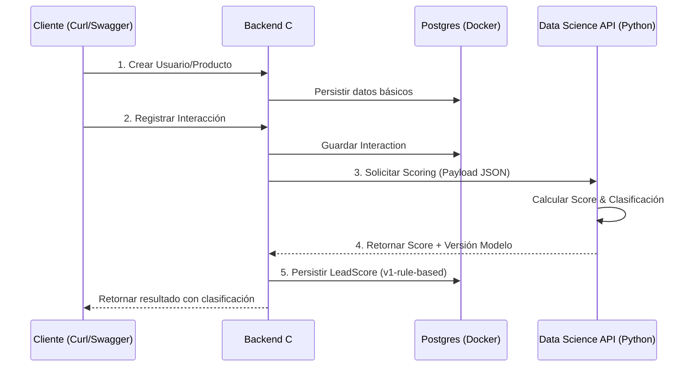

# 💻 EquineLead - Backend C#

> 📍 **Navegación**: [🏠 Inicio](../../README.md) → Componentes → Backend C#
> 🔗 **Referencia**: [Especificación Técnica de DB](../../docs/database/especificacion-tecnica-db-v2.md)

Este backend implementa una tubería de persistencia para la gestión de usuarios (leads) y productos, incluyendo el registro de interacciones y el cálculo de Lead Score mediante la integración con un motor de Data Science en Python.

> [!IMPORTANT]
> Esta documentación cubre la **Verificación en Local (Hito 1)**. La integración final en la infraestructura de **AWS** (ECS/Fargate con contenedores) es la siguiente fase del proyecto.

---

## 📊 Flujo de Gestión de Leads (Scoring)



### Detalle del Proceso (¿Cuándo interactúan las APIs?)

Para entender cómo se hablan **C#** y **Python**, imaginemos este flujo paso a paso:

1.  **Paso 1: Registro Inicial (Backend C#)**  
    Primero guardamos los datos básicos: quién es el usuario y qué productos tenemos. Esto se queda guardado en **Postgres**. En este punto, Python todavía no sabe nada.
    
2.  **Paso 2: El Evento Disparador (Backend C#)**  
    Cuando registras una **Interacción** (ej: Carlos vio una Gorra), el Backend C# recibe la orden. Antes de terminar, el Backend dice: *"Oye, necesito saber el puntaje de este tipo"*.
    
3.  **Paso 3: El Pedido al Experto (Interacción C# → Python) 🔄**  
    Aquí es donde ocurre la magia. El Backend C# prepara un paquete de datos (JSON) con el presupuesto del usuario, su tipo (B2B/B2C) y lo que acaba de hacer. Se lo envía por la red a la **API de Data Science (Python)** en el puerto 8090.
    
4.  **Paso 4: El Cálculo Inteligente (Data Science Python)**  
    La API de Python recibe el paquete. No guarda nada en base de datos, solo "piensa". Aplica las reglas de negocio (ej: si presupuesto > 40k, suma puntos) y genera un **Score (Número)** y una **Clasificación (Cold/Warm/Hot)**.
    
5.  **Paso 5: La Respuesta (Python → C#) 🔄**  
    Python le devuelve el resultado al Backend C#. *"Toma, Carlos tiene 20 puntos y es un lead Frío (Cold)"*.
    
6.  **Paso 6: Persistencia Final (Backend C#)**  
    El Backend C# recibe la respuesta, la traduce a su formato y la guarda permanentemente en la tabla `LeadScores` de la base de datos. Recién ahí, vos ves el resultado en tu pantalla.

---

## 🚀 Guía de Levantamiento Local (Paso a Paso)

Para que el sistema funcione correctamente, se deben levantar los componentes en el orden indicado. 

> [!TIP]
> **Terminal 1**: Dedicada exclusivamente al Motor de IA (Python).
> **Terminal 2**: Para la Base de Datos y el Backend C#.

### 1️⃣ El Motor de Inteligencia (FastAPI - Python)
Levantamos al "Chef" que calculará los puntajes. Debe estar activo antes de enviar interacciones desde C#.
1. Abre una **Terminal 1** y ve a la raíz del proyecto.
2. Ejecuta:
   ```bash
   PYTHONPATH=src/data-science ./venv/bin/python3 -m uvicorn api:app --host 0.0.0.0 --port 8090
   ```
Recuerda dejar esta terminal abierta y visible para ver los logs de scoring.

### 2️⃣ Pasos Iniciales (Solo la primera vez)
En una **Terminal 2**, configura el acceso a las herramientas de .NET si no lo has hecho:
```bash
export DOTNET_ROOT=/snap/dotnet-sdk/current
export PATH="$PATH:$HOME/.dotnet/tools"
```

### 3️⃣ La Base de Datos (PostgreSQL en Docker)
Levantamos el "Almacén" de datos en la **Terminal 2**.
```bash
# Limpiar si existe uno previo
sudo docker rm -f equine-postgres

# Crear y levantar el contenedor
sudo docker run -d --name equine-postgres \
  -e POSTGRES_DB=NoCountryE48DB \
  -e POSTGRES_USER=postgres \
  -e POSTGRES_PASSWORD=postgres123 \
  -p 5432:5432 postgres:15
```

### 4️⃣ El Backend C# (ASP.NET Core)
Finalmente, levantamos el servidor principal en la **Terminal 2**.
1. Ve a la carpeta `src/backend-csharp/`.
2. Crea las tablas en la base de datos (Migraciones):
   ```bash
   dotnet ef database update --context AppDbContext
   ```
3. Inicia el servidor:
   ```bash
   dotnet run
   ```

---

## 🔌 Contratos JSON (C# ↔ Python)

La comunicación entre el Backend C# y la API de Data Science sigue un contrato estricto de JSON.

### Request (C# → Python)
Enviado cuando se registra una interacción:
```json
{
  "userId": "1",
  "userType": "B2B",
  "userBudget": 50000.0,
  "createdAt": "2024-02-27T10:00:00Z",
  "interactions": [
    {
      "interactionType": 2,
      "interactionDate": "2024-02-27T10:05:00Z"
    }
  ]
}
```
*   **interactionType**: 1=View, 2=Click, 3=Download, 4=Consult, 5=ContactRequest.

### Response (Python → C#)
Retornado tras calcular el score:
```json
{
  "userId": "1",
  "leadScoreValue": 65.5,
  "leadScoreClassification": 2,
  "leadScoreLabel": "Warm",
  "scoreDate": "2024-02-27T10:06:00Z",
  "scoreModelVersion": "v1-rule-based"
}
```

---

## ✅ Verificación del Funcionamiento

### 🌐 A través del Navegador (Swagger)
Accede a: 👉 [http://localhost:5286/swagger](http://localhost:5286/swagger)

**Flujo de prueba completo:**

1.  **POST `/api/User`**: Crea un lead.
    ```json
    {
      "userName": "Juan Perez",
      "userType": "B2C",
      "userBudget": 15000,
      "userPhone": "123456789",
      "userEmail": "juan@example.com",
      "userCity": "Cali"
    }
    ```
2.  **POST `/api/Product`**: Crea un producto.
    ```json
    {
      "productName": "Silla Ecuestre Premium",
      "productPrice": 1200,
      "productCategory": "Equipamiento"
    }
    ```
3.  **POST `/api/Interaction`**: Registra actividad. **Esto dispara el scoring**.
    ```json
    {
      "userId": 1,
      "productId": 1,
      "interactionSource": "Web",
      "interactionType": "Click",
      "interactionMetadataJson": "{\"device\": \"mobile\", \"browser\": \"chrome\"}"
    }
    ```
    *(Nota: Usa valores válidos de Enum: `Facebook`, `Instagram`, `Web`, `Formulario`, `Otro` para la fuente; y `View`, `Click`, `Download`, `Consult`, `ContactRequest` para el tipo).*
4.  **GET `/api/Score/top?take=5`**: Verifica el resultado final.
    *   Este endpoint te devolverá el ranking de leads con el **LeadScoreValue** calculado por la IA y su clasificación (Cold/Warm/Hot).
    *   **Parámetro `take`**: Indica cuántos registros quieres ver (ej: `take=5` para ver los mejores 5). Si no lo pones, por defecto muestra 10.

### 🖥️ A través de Terminal (SQL)

#### 1. Registrar un Usuario manualmente
Si prefieres usar SQL para insertar un usuario de prueba:
```bash
sudo docker exec -it equine-postgres psql -U postgres -d NoCountryE48DB -c "
INSERT INTO \"Users\" (\"UserName\", \"UserType\", \"UserBudget\", \"UserPhone\", \"UserEmail\", \"UserCity\", \"UserCreatedAt\")
VALUES ('Maria Lopez', 2, 60000, '987654321', 'maria@b2b.com', 'Bogotá', NOW());"
```
*(Nota: UserType 2 = B2B)*

#### 2. Verificar que el usuario existe
Antes de que tenga un score, puedes verificar que se guardó correctamente:
```bash
sudo docker exec -it equine-postgres psql -U postgres -d NoCountryE48DB -c "SELECT * FROM \"Users\";"
```

#### 3. Verificar Ranking de Leads (Requiere Score)
> [!NOTE]
> Esta consulta solo mostrará filas si el usuario ya tiene un **LeadScore**. El score se genera automáticamente al registrar una **Interacción** (vía Swagger o API).

Para ver los resultados del scoring calculados por Python y guardados por C#:
```bash
sudo docker exec -it equine-postgres psql -U postgres -d NoCountryE48DB -c "
SELECT u.\"UserName\", s.\"LeadScoreValue\", s.\"LeadScoreClassification\", s.\"ScoreModelVersion\"
FROM \"Users\" u
JOIN \"LeadScores\" s ON u.\"UserId\" = s.\"UserId\"
ORDER BY s.\"LeadScoreValue\" DESC;"
```

---

## 🧱 Componentes técnicos
- **Users**: Puerta de entrada para leads (viene de la **Landing Page**).
- **Products**: Catálogo de productos (puede ser poblado por el **Scrapper**).
- **LeadInteractions**: Registro de actividad (triggers de scoring).
- **LeadScores**: Resultados persistidos del motor de Data Science.

---

## 🔮 Visión y Escalabilidad (Scraping & Landing Page)

Esta arquitectura está diseñada para ser el núcleo de un sistema más grande:
1.  **Origen Landing Page**: El backend C# ya tiene los endpoints listos para recibir los datos de contacto y presupuesto que los usuarios dejen en la landing.
2.  **Origen Scraping (Rust)**: El módulo de Scrapper puede enviar periódicamente nuevos productos o actualizaciones de precios a través de la API de C#, manteniendo el catálogo sincronizado.
3.  **Flexibilidad de Data Science**: Al estar desacoplado, el motor de Python puede evolucionar para usar datos más complejos recolectados por el scrapper (como tendencias de mercado) sin necesidad de modificar drásticamente el backend de C#.
4.  **Dataset Sintético - El Laboratorio**: El proyecto cuenta con un dataset sintético que permite:
    - **Simular Escenarios**: Probar cómo reacciona el sistema ante miles de leads antes de tener tráfico real.
    - **Calibrar Reglas**: Ajustar los umbrales (40/80) basándose en distribuciones realistas de datos.
    - **Entrenamiento Futuro**: Servir como base para pasar de un modelo de "reglas fijas" a un modelo de "Aprendizaje Automático (Machine Learning)" real.

## Tecnologías usadas
- ASP.NET Core 8.0
- Entity Framework Core (PostgreSQL Provider)
- Npgsql (EnableLegacyTimestampBehavior habilitado)
- Docker (PostgreSQL 15)
- Swagger / OpenAPI

## 🧪 **Testing Relacionado**
Consulta las carpetas de pruebas para más detalle:
- [Testing de Backend](../../tests/backend-csharp/README.md)
