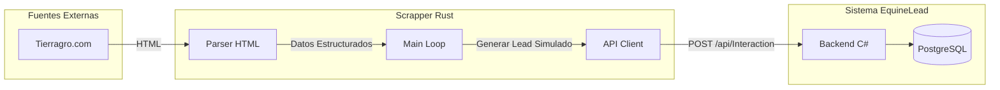

# 🦀 EquineLead - Scrapper Rust

> 📍 **Navegación**: [🏠 Inicio](../../README.md) → Componentes → **Scrapper Rust**

Este componente es el motor de recolección de datos del ecosistema EquineLead. Está diseñado en **Rust** para ofrecer alto rendimiento, seguridad de memoria y concurrencia eficiente al extraer información de portales equinos.

---

## 🎯 Objetivo

El scrapper tiene tres funciones principales:
1.  **Extracción Real**: Obtiene productos, precios y categorías de fuentes activas (actualmente **Tierragro.com**).
2.  **Alineación con el Backend**: Sincroniza el catálogo de productos del Backend C# con datos reales del mercado.
3.  **Simulación de Leads**: Genera interacciones realistas (clics, vistas, consultas) distribuidas probabilisticamente entre diversas fuentes (Instagram, Facebook, Web, etc.) para alimentar el motor de Data Science.

---

## 📊 Flujo de Datos



---

## ⚙️ Configuración (.env)

El scrapper es altamente configurable mediante variables de entorno. Crea un archivo `.env` basado en `.env.example`:

| Variable | Descripción | Valor por Defecto |
| :--- | :--- | :--- |
| `BACKEND_URL` | URL del Backend C# | `http://localhost:5286` |
| `TARGET_URL` | URL de la categoría a scrapear | `https://tierragro.com/...` |
| `WEIGHT_INSTAGRAM` | Peso (0-100) para fuente Instagram | `50` |
| `WEIGHT_WEB` | Peso (0-100) para fuente Web | `20` |
| `SCRAP_DELAY_SEC` | Delay entre productos para evitar bloqueos | `2` |

---

## 🚀 Guía de Levantamiento

### Opción A: Levantamiento Local (Nativo)

**Prerrequisitos**: Rust 1.83+ instalado.

1.  **Configurar entorno**:
    ```bash
    cp .env.example .env
    # Asegurar que las herramientas de Rust estén en el PATH
    source $HOME/.cargo/env
    ```
2.  **Ejecutar**:
    ```bash
    cargo run
    ```

---

## 🛠️ Solución de Problemas

### Error: `command not found: cargo`
Esto ocurre si el entorno de Rust no ha sido cargado en tu terminal actual.
**Solución**: Ejecuta `source $HOME/.cargo/env`.

### Error: `feature edition2024 is required`
El scrapper requiere una versión moderna de Rust.
**Solución**: Ejecuta `rustup update stable` para actualizar a la última versión.

### Opción B: Levantamiento con Docker (Contenedor)

1.  **Construir imagen**:
    ```bash
    docker build -t equine-scrapper .
    ```
2.  **Correr contenedor**:
    ```bash
    docker run --env-file .env equine-scrapper
    ```

> [!TIP]
> En el flujo de orquestación, el scrapper está integrado en el `docker-compose.yml` de la raíz. Puedes lanzarlo junto al resto del sistema con `docker compose up scrapper`.

---

## 🛠️ Tecnologías Usadas
- **Lenguaje**: Rust (Edition 2021)
- **Runtime**: Tokio (Async)
- **HTTP Client**: Reqwest
- **HTML Parsing**: Scraper (basado en selectores CSS)
- **Config**: Dotenvy

---

## 🧪 Testing Relacionado
Consulta las pruebas de salud del scrapper en:
- [Testing de Scrapper](../../tests/scrapper-rust/README.md)
