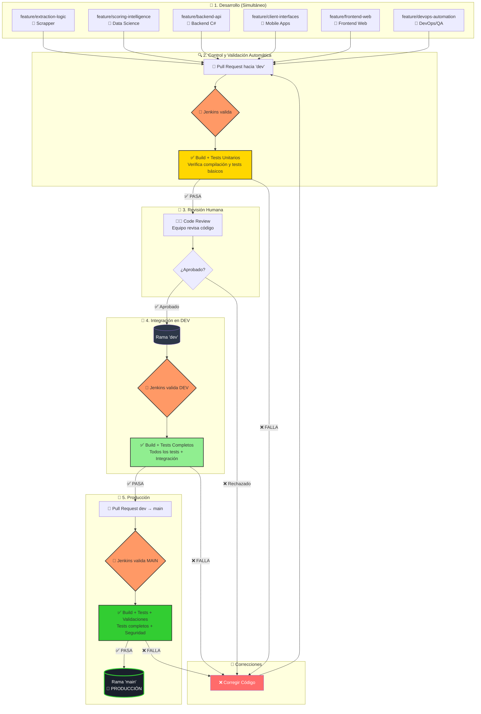

# 🧪 EquineLead - Testing Infrastructure

> **Analogía Central**: Imagina que EquineLead es un **auto de carreras de alta tecnología**.<br> 
Antes de que salga a la pista (producción), necesitamos que pase por una **inspección técnica completa**. <br>
Esta carpeta `tests/` contiene todos los **manuales de inspección** y **herramientas de diagnóstico** que usan nuestros "mecánicos automáticos" (Jenkins) para verificar que cada componente funcione perfectamente.

---

## 🎯 **Propósito de esta Carpeta**

Esta carpeta centraliza **toda la infraestructura de testing** del proyecto EquineLead. Aquí encontrarás:

- ✅ **Tests básicos** (health checks) para cada componente
- ✅ **Scripts de automatización** para ejecutar tests
- ✅ **Configuración de frameworks** de testing
- ✅ **Tests de integración** entre componentes

---

## 🏗️ **Estructura de Carpetas**

```
tests/
├── backend-csharp/       # 🔧 Tests del motor (Backend C#)
├── data-science/         # 🧠 Tests del cerebro (ML/IA)
├── scrapper-rust/        # 🦀 Tests de los sensores (Scrapper)
├── frontend-web/         # 🎨 Tests del tablero (Dashboard + Landing)
├── mobile-apps/          # 📱 Tests de apps móviles
├── integration/          # 🔗 Tests de comunicación entre componentes
└── scripts/              # 🤖 Scripts de automatización
```

---

## 🚗 **La Analogía del Auto de Carreras**

Para entender mejor cómo funciona el testing en EquineLead, usamos esta analogía consistente:

| Componente | Parte del Auto | Qué Verifica |
|------------|----------------|--------------|
| **Backend C#** | 🔧 Motor | Que el motor arranque y funcione |
| **Data Science** | 🧠 Sistema de Navegación | Que la IA/ML procese datos correctamente |
| **Scrapper Rust** | 📡 Sensores | Que capture datos del exterior |
| **Frontend Web** | 🎨 Tablero | Que la interfaz muestre información |
| **Integration** | 🔗 Cableado | Que todos los sistemas se comuniquen |
| **Scripts** | 🤖 Mecánico Automático | Que ejecute inspecciones automáticamente |

---

## 🚀 **Cómo Usar Esta Infraestructura**

### **Opción 1: Ejecutar TODOS los tests**

```bash
# Desde la raíz del proyecto
./tests/scripts/run_all_tests.sh
```

**💾 Guardar resultados como log (para verificación manual):**

```bash
# Ejecutar y guardar con timestamp (crea carpeta logs/ automáticamente)
mkdir -p logs && ./tests/scripts/run_all_tests.sh > "logs/all_tests_$(date +%Y%m%d_%H%M%S).log" 2>&1

# Ver el log después
cat logs/all_tests_*.log | tail -50
```

Este script ejecuta:
1. Tests de Backend C#
2. Tests de Data Science
3. Tests de Scrapper Rust
4. Tests de Frontend Web

---

### **Opción 2: Ejecutar tests de un componente específico**

```bash
# Backend C#
./tests/scripts/run_backend_tests.sh

# Data Science
./tests/scripts/run_datascience_tests.sh

# Scrapper Rust
./tests/scripts/run_scrapper_tests.sh

# Frontend Web
./tests/scripts/run_frontend_tests.sh
```

**💾 Guardar resultados individuales como log:**

```bash
# Backend C#
mkdir -p logs && ./tests/scripts/run_backend_tests.sh > "logs/backend_tests_$(date +%Y%m%d_%H%M%S).log" 2>&1

# Data Science
mkdir -p logs && ./tests/scripts/run_datascience_tests.sh > "logs/datascience_tests_$(date +%Y%m%d_%H%M%S).log" 2>&1

# Scrapper Rust
mkdir -p logs && ./tests/scripts/run_scrapper_tests.sh > "logs/scrapper_tests_$(date +%Y%m%d_%H%M%S).log" 2>&1

# Frontend Web
mkdir -p logs && ./tests/scripts/run_frontend_tests.sh > "logs/frontend_tests_$(date +%Y%m%d_%H%M%S).log" 2>&1
```

---

### **Opción 3: Verificar solo compilación (sin tests)**

```bash
# Verifica que todos los componentes compilen
./tests/scripts/check_builds.sh
```

---

## ⚙️ **Instalación de Herramientas (Setup Inicial)**

Antes de ejecutar tests localmente, necesitas instalar dos tipos de componentes:

1. **Herramientas del Sistema** (versión mínima flexible)
2. **Dependencias del Proyecto** (versión exacta vía archivos de configuración)

---

### **📋 Tabla de Requisitos de Versiones**

| Tipo | Herramienta | Versión Mínima | Versión Exacta Necesaria | Archivo de Control |
|------|-------------|----------------|--------------------------|-------------------|
| **Sistema** | Python | 3.8+ | ❌ No | - |
| **Sistema** | .NET SDK | 6.0+ | ⚠️ Major version (6.x o 8.x) | - |
| **Sistema** | Rust/Cargo | 1.70+ | ❌ No | - |
| **Sistema** | Node.js | 16+ (LTS) | ⚠️ Major version (16.x o 18.x) | - |
| **Dependencias** | pytest, numpy, etc. | - | ✅ SÍ | `requirements.txt` |
| **Dependencias** | Jest, React, etc. | - | ✅ SÍ | `package.json` |
| **Dependencias** | serde, tokio, etc. | - | ✅ SÍ | `Cargo.toml` |

> **💡 Clave**:<br>
> Las **herramientas del sistema** pueden tener versiones flexibles.<br> 
> Las **dependencias del proyecto** DEBEN usar versiones exactas definidas en archivos de configuración.

---

### **🔧 Preparación del Entorno**

**Activar entorno virtual (necesario para Python/Data Science):**

```bash
# Linux / macOS
source venv/bin/activate

# Windows (PowerShell)
venv\Scripts\Activate.ps1

# Windows (CMD)
venv\Scripts\activate.bat
```

---

### **1️⃣ Backend C# (xUnit)**

#### **Paso 1: Instalar .NET SDK (Herramienta del Sistema)**

**Todos los sistemas operativos:**
- 🌐 Descargar desde: https://dotnet.microsoft.com/download

**O usar gestores de paquetes:**

```bash
# 🐧 Linux (Ubuntu/Debian)
sudo snap install dotnet-sdk --classic
# Nota: El flag --classic es necesario y seguro

# 🪟 Windows (PowerShell como administrador)
winget install Microsoft.DotNet.SDK.8
# O descargar el instalador desde el link de arriba

# 🍎 macOS
brew install dotnet-sdk
```

**Verificar instalación (todos los SOs):**
```bash
dotnet --version  # Debe mostrar 6.x o superior
```

#### **Paso 2: Las dependencias NuGet se instalan automáticamente**

```bash
# .NET restaura dependencias automáticamente al compilar
dotnet restore  # (opcional, se ejecuta automáticamente)
```

---

### **2️⃣ Data Science (pytest)**

#### **Paso 1: Verificar Python (Herramienta del Sistema)**

**Verificar instalación:**
```bash
# 🐧 Linux / 🍎 macOS
python3 --version

# 🪟 Windows
python --version
```

**Si no está instalado:**
- 🌐 Descargar desde: https://www.python.org/downloads/
- 🐧 Linux: `sudo apt install python3`
- 🍎 macOS: `brew install python@3.12`
- 🪟 Windows: Descargar instalador o usar `winget install Python.Python.3.12`

#### **Paso 2: Instalar Dependencias Exactas (desde requirements.txt)**

```bash
# IMPORTANTE: Instalar desde requirements-test.txt (versiones exactas)
pip install -r tests/data-science/requirements-test.txt

# Verificar que pytest se instaló
pytest --version
```

> **⚠️ IMPORTANTE**:<br> 
> NO instales `pip install pytest` directamente. <br>
> Usa siempre `requirements-test.txt` para garantizar versiones exactas.<br>
> NO instalar `npm install jest` globalmente


---

### **3️⃣ Scrapper Rust (cargo test)**

#### **Paso 1: Instalar Rust y Cargo (Herramienta del Sistema)**

**Instalación oficial (recomendada para todos los SOs):**
- 🌐 https://rustup.rs/

```bash
# 🐧 Linux / 🍎 macOS
curl --proto '=https' --tlsv1.2 -sSf https://sh.rustup.rs | sh
source $HOME/.cargo/env

# 🪟 Windows
# Descargar e instalar desde: https://rustup.rs/
# O ejecutar en PowerShell:
winget install Rustlang.Rustup
```

**Alternativa rápida (solo Linux):**
```bash
# 🐧 Linux (Ubuntu/Debian)
sudo apt install cargo
```

**Verificar instalación (todos los SOs):**
```bash
cargo --version  # Debe ser 1.70+ o superior
rustc --version
```

#### **Paso 2: Las dependencias se gestionan automáticamente**

```bash
# Cargo.toml y Cargo.lock definen versiones exactas
# Se instalan automáticamente al compilar
cargo build  # (opcional, se ejecuta automáticamente)
```

---

### **4️⃣ Frontend Web (Jest)**

#### **Paso 1: Instalar Node.js y npm (Herramienta del Sistema)**

**Todos los sistemas operativos:**
- 🌐 Descargar desde: https://nodejs.org/ (versión LTS recomendada)

**O usar gestores de paquetes:**

```bash
# 🐧 Linux (Ubuntu/Debian)
sudo apt install nodejs npm

# 🪟 Windows (PowerShell como administrador)
winget install OpenJS.NodeJS.LTS
# O descargar el instalador desde nodejs.org

# 🍎 macOS
brew install node
```

**Verificar instalación (todos los SOs):**
```bash
node --version  # Debe ser 16.x o superior
npm --version
```

#### **Paso 2: Instalar Dependencias Exactas (desde package.json)**

```bash
# IMPORTANTE: Instalar desde package.json (versiones exactas)
npm install --prefix tests/frontend-web/

# Verificar que Jest se instaló
npm test --prefix tests/frontend-web/ --version
```

> **⚠️ IMPORTANTE**: 
> - NO instales `npm install jest` globalmente. 
> - Usa siempre `npm install` en el directorio del proyecto para respetar `package.json` y `package-lock.json`.

---

### **✅ Verificación Completa**

Para verificar qué herramientas ya tienes instaladas:

```bash
# Verificar herramientas del sistema
echo "=== Herramientas del Sistema ==="
python3 --version 2>/dev/null || echo "❌ Python no instalado"
dotnet --version 2>/dev/null || echo "❌ .NET no instalado"
cargo --version 2>/dev/null || echo "❌ Cargo no instalado"
node --version 2>/dev/null || echo "❌ Node.js no instalado"
npm --version 2>/dev/null || echo "❌ npm no instalado"

# Verificar dependencias del proyecto (dentro del venv)
echo -e "\n=== Dependencias del Proyecto ==="
pytest --version 2>/dev/null || echo "❌ pytest no instalado (ejecuta: pip install -r tests/data-science/requirements-test.txt)"
```

---

### **💡 ¿Qué Instalar?**

**No necesitas instalar TODO**. Instala solo lo que necesites:

| Si trabajas en... | Herramientas del Sistema | Dependencias del Proyecto |
|-------------------|-------------------------|---------------------------|
| Backend C# | .NET SDK 6.0+ | (automático vía NuGet) |
| Data Science | Python 3.8+ | `pip install -r tests/data-science/requirements-test.txt` |
| Scrapper | Rust/Cargo 1.70+ | (automático vía Cargo.toml) |
| Frontend Web | Node.js 16+, npm | `npm install --prefix tests/frontend-web/` |
| **Quiero probar todo** | Todas las herramientas | Todos los requirements |

---

### **🎯 Resumen: Versiones Exactas vs Mínimas**

| Concepto | Qué es | Ejemplo | Cómo se Controla |
|----------|--------|---------|------------------|
| **Versión Mínima** | Herramientas del sistema pueden ser cualquier versión compatible | Python 3.8, 3.9, 3.10, 3.12 (cualquiera funciona) | Documentación en README |
| **Versión Exacta** | Dependencias del proyecto deben ser versiones específicas | pytest==9.0.2 (exactamente esta versión) | `requirements.txt`, `package.json`, `Cargo.toml` |

**Regla de Oro**: 
- ✅ **Herramientas del sistema**: Versión mínima OK
- ✅ **Dependencias del proyecto**: Siempre usar archivos de configuración (`requirements.txt`, `package.json`, `Cargo.toml`)

---

## 📊 **Flujo de Trabajo con Jenkins**

### **🔄 Cómo Funciona la Integración Tests ↔ Jenkins**

**Pregunta clave**: ¿Quién llama a quién?

**Respuesta**: **Jenkins llama a los tests**, no al revés. Existen dos formas de ejecutar tests:

#### **1️⃣ Ejecución Automática (Jenkins)**
1. **Developer hace push** → GitHub detecta el cambio
2. **GitHub notifica a Jenkins** vía webhook (GitHub → Jenkins)
3. **Jenkins se activa automáticamente** y ejecuta el Jenkinsfile correspondiente
4. **Jenkins ejecuta los scripts de tests** (ej: [./tests/scripts/run_backend_tests.sh](cci:7://file:///home/degops/Projects/Repositorios/repo_NoCountryChallenges/Work%20simulation/equine-lead/tests/scripts/run_backend_tests.sh:0:0-0:0))
5. **Los scripts ejecutan los tests** (ej: `dotnet test`, [pytest](cci:1://file:///home/degops/Projects/Repositorios/repo_NoCountryChallenges/Work%20simulation/equine-lead/tests/data-science/test_health.py:29:0-33:60), etc.)
6. **Los tests corren y reportan** resultados (✅ pasan o ❌ fallan)
7. **Jenkins recibe el resultado** y actualiza el estado del PR en GitHub

#### **2️⃣ Ejecución Manual (Developer Local)**
- **Propósito**: Verificar que tu código funciona **ANTES** de hacer push
- **Cómo**: Ejecutas los mismos scripts que Jenkins usa (ej: [./tests/scripts/run_backend_tests.sh](cci:7://file:///home/degops/Projects/Repositorios/repo_NoCountryChallenges/Work%20simulation/equine-lead/tests/scripts/run_backend_tests.sh:0:0-0:0))
- **Ventaja**: Detectas errores localmente, evitas fallos en Jenkins y PRs bloqueados
- **Cuándo**: Siempre antes de commit y push

**En resumen**: 
- ✅ **Jenkins es el orquestador automático** - Valida cada push/PR
- ✅ **Los tests son herramientas** - Pueden ejecutarse manual o automáticamente
- ✅ **Ejecución manual = prevención** - Verifica tu código antes de push
- ✅ **GitHub es el disparador** - Activa a Jenkins con cada push/PR

---

Este diagrama muestra cómo los tests se integran con Jenkins en el ciclo de desarrollo completo:



### **📋 Qué Ejecuta Jenkins en Cada Etapa**

#### **Estado Actual (MVP)**

| Etapa | Rama | Jenkins Ejecuta AHORA | Qué Tests Corre |
|-------|------|----------------------|-----------------|
| **PR a dev** | `feature/*` | ✅ Build + Health Checks | Solo `health_check_test.*` de cada componente |
| **Merge a dev** | `dev` | ✅ Build + Health Checks | Solo `health_check_test.*` de cada componente |
| **Merge a main** | `main` | ✅ Build + Health Checks | Solo `health_check_test.*` de cada componente |

> **Nota MVP**: Actualmente solo existen health checks básicos. Los tests unitarios y de integración se agregarán cuando los equipos entreguen código funcional.

---

#### **🔄 Evolución del Testing (Roadmap)**

| Fase | Tests Disponibles | Jenkins Ejecutará | Estado |
|------|-------------------|-------------------|--------|
| **Fase 1 (MVP Actual)** | Solo `health_check_test.*` | Build + Health Checks | ✅ Implementado |
| **Fase 2** | Health checks + Tests de servicios/funciones | Build + Tests Unitarios | ⚠️ Pendiente |
| **Fase 3** | + Tests de controladores/componentes | Build + Tests Unitarios Completos | ⚠️ Pendiente |
| **Fase 4** | + Tests de integración entre componentes | Build + Tests Completos | ⚠️ Pendiente |
| **Fase 5 (Futuro)** | + Tests de seguridad y performance | Build + Tests + Validaciones | ⚠️ Futuro |

**Leyenda:**
- ✅ Implementado y funcionando
- ⚠️ Pendiente (se implementará cuando haya código que testear)

---

### **🎯 Puntos Clave del Flujo**

1. **Desarrollo Paralelo**: Los 6 equipos trabajan simultáneamente en sus feature branches
2. **Validación Automática**: Jenkins valida automáticamente cada PR antes de revisión humana
3. **Doble Barrera**: Código debe pasar TANTO Jenkins COMO revisión humana
4. **Validación Incremental**: Más validaciones conforme el código avanza hacia producción (cuando se implementen)
5. **Ciclo de Corrección**: Si algo falla, el developer corrige y vuelve a intentar
6. **MVP Pragmático**: Empezamos con health checks básicos, expandiremos cuando haya código funcional

---

## 🎓 **Para Principiantes (Nivel Dummie)**

### **¿Qué es un test?**

Un **test** es como una **pregunta de examen** para tu código:

```python
# Pregunta: ¿2 + 2 = 4?
def test_suma():
    resultado = 2 + 2
    assert resultado == 4  # ✅ Correcto!
```

Si el código responde correctamente → ✅ Test pasa  
Si el código responde mal → ❌ Test falla

---

### **¿Por qué necesitamos tests?**

Imagina que cambias una pieza del motor (código). Sin tests:
- ❌ No sabes si rompiste algo
- ❌ Descubres errores en producción (¡desastre!)
- ❌ Los usuarios sufren bugs

Con tests:
- ✅ Sabes inmediatamente si algo se rompió
- ✅ Detectas errores ANTES de producción
- ✅ Los usuarios tienen una experiencia sin bugs

---

### **¿Qué son los "health checks"?**

Son los **tests más básicos** que verifican que tu entorno de desarrollo está correctamente configurado. Piensa en ellos como la "lista de verificación pre-vuelo" antes de despegar.

#### **1. ✅ ¿El código compila?**

**Qué verifica:**
- Que el código fuente no tenga errores de sintaxis
- Que todas las importaciones/referencias sean válidas
- Que el compilador/intérprete pueda procesar el código sin errores

**Ejemplos por componente:**
- **Backend C#**: `dotnet build` compila sin errores → El código C# es sintácticamente correcto
- **Data Science**: `python3 -m py_compile` no lanza excepciones → El código Python es válido
- **Scrapper Rust**: `cargo build` compila sin errores → El código Rust es sintácticamente correcto
- **Frontend Web**: El código JavaScript no tiene errores de sintaxis

**Por qué es importante:**
Si el código no compila, **ningún test puede ejecutarse**. Es el requisito mínimo.

---

#### **2. ✅ ¿El framework de testing funciona?**

**Qué verifica:**
- Que el framework de testing (xUnit, pytest, Jest, etc.) esté correctamente instalado
- Que pueda descubrir y ejecutar tests
- Que la configuración del framework sea válida

**Ejemplos por componente:**
- **Backend C#**: xUnit puede ejecutar tests → `dotnet test` funciona
- **Data Science**: pytest puede descubrir tests → `pytest --collect-only` lista tests
- **Scrapper Rust**: cargo test puede ejecutar tests → `cargo test` funciona
- **Frontend Web**: Jest puede ejecutar tests → `npm test` funciona

**Por qué es importante:**
Si el framework no funciona, no puedes ejecutar **ningún test**, ni siquiera los más simples.

---

#### **3. ✅ ¿Las dependencias están instaladas?**

**Qué verifica:**
- Que todas las librerías necesarias estén instaladas
- Que las versiones de las dependencias sean compatibles
- Que el gestor de paquetes (NuGet, pip, cargo, npm) funcione correctamente

**Ejemplos por componente:**
- **Backend C#**: Paquetes NuGet (xUnit, Microsoft.NET.Test.Sdk) están instalados
- **Data Science**: Paquetes Python (pytest, numpy, pandas) están instalados vía `requirements.txt`
- **Scrapper Rust**: Crates (serde, tokio) están instalados vía `Cargo.toml`
- **Frontend Web**: Paquetes npm (Jest, React Testing Library) están instalados vía `package.json`

**Por qué es importante:**
Sin dependencias, el código no puede importar librerías externas y fallará en tiempo de ejecución.

---

### **📊 Resumen Visual**

```
Health Check = Verificación Básica del Entorno

┌─────────────────────────────────────────────────────────┐
│  1. ¿Compila?                                           │
│     ├─ Sintaxis correcta                                │
│     ├─ Imports/referencias válidas                      │
│     └─ Sin errores de compilación                       │
├─────────────────────────────────────────────────────────┤
│  2. ¿Framework de testing funciona?                     │
│     ├─ xUnit/pytest/Jest instalado                      │
│     ├─ Puede descubrir tests                            │
│     └─ Configuración válida                             │
├─────────────────────────────────────────────────────────┤
│  3. ¿Dependencias instaladas?                           │
│     ├─ Librerías externas disponibles                   │
│     ├─ Versiones compatibles                            │
│     └─ Gestor de paquetes funciona                      │
└─────────────────────────────────────────────────────────┘

Si TODO pasa → Entorno listo para desarrollo ✅
Si ALGO falla → Arreglar antes de escribir código ❌
```
### **📊 Estado Actual (MVP - Health Checks)**

```
src/
├── backend-csharp/     ❌ Solo README, sin código real
├── data-science/       ❌ Solo README, sin código real
├── scrapper-rust/      ❌ Solo README, sin código real
└── frontend-web/       ❌ Solo README, sin código real

tests/
├── backend-csharp/     ✅ Health check tests funcionando
├── data-science/       ✅ Health check tests funcionando
├── scrapper-rust/      ✅ Health check tests funcionando
└── frontend-web/       ✅ Health check tests funcionando
```
### ¿Qué verifican los Health Checks entonces?

Los health checks NO verifican código de negocio (porque no existe aún). Verifican:

1. ✅ Entorno de testing configurado - xUnit, pytest, cargo test, Jest funcionan
2. ✅ Archivos de configuración válidos - `.csproj`, `Cargo.toml`, `package.json`, `jest.config.js`
3. ✅ Dependencias de testing instaladas - Frameworks de testing disponibles
4. ✅ Sintaxis básica funciona - Los tests mismos compilan/ejecutan

> ✅ Ahora: Health checks = "¿El entorno de testing funciona?"

### Cuando los equipos entreguen código real:

```
src/
├── backend-csharp/     ✅ Código C# real (API, servicios, etc.)
├── data-science/       ✅ Código Python real (ML, FastAPI, etc.)
├── scrapper-rust/      ✅ Código Rust real (scraper, parsers, etc.)
└── frontend-web/       ✅ Código React/JS real (UI, componentes, etc.)

tests/
├── backend-csharp/     ✅ Tests unitarios + integración REALES
├── data-science/       ✅ Tests unitarios + integración REALES
├── scrapper-rust/      ✅ Tests unitarios + integración REALES
└── frontend-web/       ✅ Tests unitarios + E2E REALES
```
✅ Después: Tests reales = "¿El código de negocio funciona correctamente?"

---

**Analogía**: Es como verificar que el auto encienda, que tenga gasolina, y que los frenos funcionen **antes** de revisar si acelera bien o si el aire acondicionado enfría.


---

## 📚 **Documentación Detallada por Componente**

Cada componente tiene su propio README con instrucciones específicas:

### **Backend C#**
📖 [Ver documentación de tests de Backend](./backend-csharp/README.md)
- Framework: xUnit
- Comandos: `dotnet test`
- Tipos de tests: Unitarios + Integración

---

### **Data Science (Python)**
📖 [Ver documentación de tests de Data Science](./data-science/README.md)
- Framework: pytest
- Comandos: `pytest`
- Tipos de tests: Unitarios + API

---

### **Scrapper (Rust)**
📖 [Ver documentación de tests de Scrapper](./scrapper-rust/README.md)
- Framework: Cargo Test (built-in)
- Comandos: `cargo test`
- Tipos de tests: Unitarios + Integración

---

### **Frontend Web**
📖 [Ver documentación de tests de Frontend](./frontend-web/README.md)
- Framework: Jest + Testing Library
- Comandos: `npm test`
- Tipos de tests: Unitarios + E2E

---

### **Scripts de Automatización**
📖 [Ver documentación de scripts](./scripts/README.md)
- Scripts bash para ejecutar tests
- Verificación de builds
- Integración con Jenkins

---

## 🔄 **Integración con CI/CD**

Los tests se ejecutan automáticamente vía Jenkins cuando:

1. **Push a feature branch** → Ejecuta tests del componente modificado
2. **Pull Request a `dev`** → Ejecuta TODOS los tests
3. **Merge a `main`** → Ejecuta tests + validaciones de seguridad

Ver: [Documentación de Jenkins](../ci-cd/jenkins/README.md)

---

## 📋 **Estado Actual (MVP)**

| Componente | Tests Básicos | Tests Unitarios | Tests Integración | Estado |
|------------|---------------|-----------------|-------------------|--------|
| Backend C# | ✅ | ⚠️ Pendiente | ⚠️ Pendiente | MVP |
| Data Science | ✅ | ⚠️ Pendiente | ⚠️ Pendiente | MVP |
| Scrapper Rust | ✅ | ⚠️ Pendiente | ⚠️ Pendiente | MVP |
| Frontend Web | ✅ | ⚠️ Pendiente | ⚠️ Pendiente | MVP |

**Leyenda:**
- ✅ Implementado
- ⚠️ Pendiente (se agregará cuando los equipos entreguen código)

---

## 🤝 **Contribuir con Tests**

### **Para Developers de Cada Equipo**

> **📢 IMPORTANTE**: <br>
- Esta sección te indica **dónde y cómo** agregar tests para tu componente. <br>
- Actualmente solo existen **health checks básicos** y la **infraestructura de testing**. <br>
- Es **URGENTE** que cada equipo comience a escribir tests unitarios y de integración para su código funcional. 
- Sin tests, Jenkins solo validará compilación, no funcionalidad real.

### 🚀 **Prioridades de Testing**

**Prioridad 1: Tests Unitarios (AHORA)**
- Agreguen tests en las carpetas indicadas en los siguientes puntos
- Prueben funciones individuales de su código
- Ejemplo: Si tienen una función `calculateLeadScore()`, hagan un test para esa función

**Prioridad 2: Tests de Integración (DESPUÉS)**
- Cuando tengan varios componentes funcionando
- Prueben comunicación entre módulos
- Ejemplo: Backend llamando a Data Science API

---

## 🏗️ **Infraestructura Ya Creada (NO MODIFICAR)**

La siguiente infraestructura **YA ESTÁ CONFIGURADA** por DevOps.
Solo agrega tus tests en las carpetas indicadas en los siguientes puntos

```
tests/
├── integration/                      ❌ NO MODIFICAR (tests de integración entre componentes)
|
├── backend-csharp/                   ⚠️  Ver detalle por componente abajo
├── data-science/                     ⚠️  Ver detalle por componente abajo
├── scrapper-rust/                    ⚠️  Ver detalle por componente abajo
├── frontend-web/                     ⚠️  Ver detalle por componente abajo
├── mobile-apps/                      ⚠️  Ver detalle por componente abajo
|
├── scripts/                          ❌ NO MODIFICAR (scripts de ejecución de tests)
└── README.md                         ❌ NO MODIFICAR (este archivo)
```

> **⚠️ IMPORTANTE**: 
> - La carpeta `tests/integration/` contiene **tests de integración entre componentes** - NO la modifiques
> - La carpeta `tests/scripts/` contiene **scripts de ejecución** - NO los modifiques
> - Cada componente tiene su propia estructura y archivos de configuración - Ver detalles específicos abajo

---

## 📂 **Estructura Detallada por Componente**

### **1️⃣ Backend C# (Equipo Backend)**

```
tests/backend-csharp/

├── Integration/                      ✅ CARPETA EXISTENTE (tests de integración)
│   ├── ApiIntegrationTests.cs        ✅ AGREGAR (tests de integración)
│   └── DatabaseIntegrationTests.cs   ✅ AGREGAR (tests de integración)
|
├── UnitTests/
|   ├── bin/, Controllers/, obj/      ❌ NO MODIFICAR (configuración de infraestructura)
│   ├── backend-tests.csproj          ❌ NO MODIFICAR (configuración de infraestructura)
|   | 
│   ├── UserServiceTests.cs           ✅ AGREGAR (tus tests unitarios)
│   ├── AuthControllerTests.cs        ✅ AGREGAR (tus tests unitarios)
│   ├── LeadRepositoryTests.cs        ✅ AGREGAR (tus tests unitarios)
│   └── ... (más tests unitarios)
│
├── .gitignore                        ❌ NO MODIFICAR (configuración de infraestructura)
├── health_check_test.cs              ❌ NO MODIFICAR (health check de DevOps)
└── README.md                         ⚠️  OPCIONAL (actualizar con tus tests)
```

**Comandos para ejecutar TUS tests:**<br>
📁 Ejecutar desde: raíz del proyecto (equine-lead/)
```bash
# Después de agregar tus tests, descomentar compilación en el script
./tests/scripts/run_backend_tests.sh
```

---

### **2️⃣ Data Science (Equipo Data Science)**

```
tests/data-science/
├── integration/                      ✅ CARPETA EXISTENTE (agregar tests aquí)
│   ├── test_api_endpoints.py         ✅ AGREGAR (tests de integración)
│   ├── test_model_inference.py       ✅ AGREGAR (tests de integración)
│   └── ... (más tests de integración)
|
├── unit/                             ✅ CARPETA EXISTENTE (agregar tests aquí)
│   ├── test_model_training.py        ✅ AGREGAR (tus tests unitarios)
│   ├── test_data_preprocessing.py    ✅ AGREGAR (tus tests unitarios)
│   ├── test_feature_engineering.py   ✅ AGREGAR (tus tests unitarios)
│   └── ... (más tests unitarios)
│
├── .gitignore                        ❌ NO MODIFICAR (configuración de infraestructura)
├── pytest.ini                        ❌ NO MODIFICAR (configuración de infraestructura)
├── README.md                         ⚠️  OPCIONAL (actualizar con tus tests)
├── requirements-test.txt             ✅ AGREGAR (tus dependencias de testing)
└── test_health.py                    ❌ NO MODIFICAR (health check de DevOps)

```

**Comandos para ejecutar TUS tests:**<br>
📁 Ejecutar desde: raíz del proyecto (equine-lead/)
```bash
# Después de agregar tus tests, descomentar instalación de dependencias en el script
./tests/scripts/run_datascience_tests.sh
```
---

### **3️⃣ Frontend Web (Equipo Frontend)**

```
tests/frontend-web/
├── e2e/                              ❌ NO MODIFICAR (configuración de infraestructura)
|
├── integration/                      ✅ CARPETA EXISTENTE (agregar tests aquí)
│   ├── dashboard-flow.test.js        ✅ AGREGAR (tests de flujos)
│   ├── landing-page-flow.test.js     ✅ AGREGAR (tests de flujos)
│   └── ... (más tests de integración)
|
├── unit/                             ✅ CARPETA EXISTENTE (agregar tests aquí)
│   ├── components/
│   │   ├── Dashboard.test.js         ✅ AGREGAR (tests de componentes)
│   │   ├── LandingPage.test.js       ✅ AGREGAR (tests de componentes)
│   │   └── ... (más tests de componentes)
│   │
│   └── utils/
│       ├── helpers.test.js           ✅ AGREGAR (tests de utilidades)
│       └── ... (más tests de utilidades)
|
├── .gitignore                        ❌ NO MODIFICAR (configuración de infraestructura)
├── health_check.test.js              ❌ NO MODIFICAR (health check de DevOps)
├── jest.config.js                    ❌ NO MODIFICAR (configuración de infraestructura)
├── package-lock.json                 ❌ NO MODIFICAR (configuración de infraestructura)
├── package.json                      ❌ NO MODIFICAR (configuración de infraestructura)
└── README.md                         ⚠️  OPCIONAL (actualizar con tus tests)
```

**Comandos para ejecutar TUS tests:**<br>
📁 Ejecutar desde: raíz del proyecto (equine-lead/)
```bash
# Después de agregar tus tests
./tests/scripts/run_frontend_tests.sh
```

### **4️⃣️ Scrapper Rust (Equipo Scrapper)**

```
tests/scrapper-rust/
├── integration/                      ✅ CARPETA EXISTENTE (agregar tests aquí)
│   ├── scraping_flow_tests.rs        ✅ AGREGAR (tests de integración)
│   └── ... (más tests de integración)
|
├── unit/                             ✅ CARPETA EXISTENTE (tests unitarios)
│   ├── parser_tests.rs               ✅ AGREGAR (tus tests unitarios)
│   ├── scraper_tests.rs              ✅ AGREGAR (tus tests unitarios)
│   ├── data_extraction_tests.rs      ✅ AGREGAR (tus tests unitarios)
│   └── ... (más tests unitarios)
|
├── .gitignore                        ❌ NO MODIFICAR (configuración de infraestructura)
├── Cargo.toml                        ❌ NO MODIFICAR (configuración de infraestructura)
├── health_test.rs                    ❌ NO MODIFICAR (health check de DevOps)
└── README.md                         ⚠️  OPCIONAL (actualizar con tus tests)
```

**Comandos para ejecutar TUS tests:**<br>
📁 Ejecutar desde: raíz del proyecto (equine-lead/)
```bash
# Después de agregar tus tests, descomentar compilación en el script
./tests/scripts/run_scrapper_tests.sh
```

---

## 🎯 **Guía Rápida: ¿Qué Hacer?**

### **Paso 1: Identifica tu componente**
- ¿Eres del equipo Backend? → `tests/backend-csharp/`
- ¿Eres del equipo Data Science? → `tests/data-science/`
- ¿Eres del equipo Scrapper? → `tests/scrapper-rust/`
- ¿Eres del equipo Frontend? → `tests/frontend-web/`

### **Paso 2: Crea tus archivos de test**
- **Tests Unitarios** → Carpeta `unit/` o `UnitTests/`
- **Tests de Integración** → Carpeta `integration/` o `Integration/`

### **Paso 3: Sigue las convenciones de nombres**
- Backend C#: `*Tests.cs` (ej: `UserServiceTests.cs`)
- Data Science: `test_*.py` (ej: `test_model_training.py`)
- Scrapper Rust: `*_tests.rs` (ej: `parser_tests.rs`)
- Frontend Web: `*.test.js` (ej: `Dashboard.test.js`)

### **Paso 4: Ejecuta tus tests**
```bash
# Ejecutar tests de tu componente
./tests/scripts/run_backend_tests.sh      # Backend
./tests/scripts/run_datascience_tests.sh  # Data Science
./tests/scripts/run_scrapper_tests.sh     # Scrapper
./tests/scripts/run_frontend_tests.sh     # Frontend
```

### **Paso 5: Descomentar compilación (cuando tengas código real)**
Edita el script de tu componente y descomentar las secciones de compilación/instalación de dependencias.

---

## ⚠️ **Reglas Importantes**

### **❌ NO HAGAS ESTO:**
- ❌ Eliminar archivos `health_check_test.*`
- ❌ Modificar archivos de configuración (`.csproj`, `Cargo.toml`, `package.json`, `pytest.ini`)
- ❌ Eliminar carpetas de infraestructura (`UnitTests/`, `unit/`, `integration/`)
- ❌ Modificar scripts en `tests/scripts/`

### **✅ SÍ PUEDES HACER ESTO:**
- ✅ Agregar tus archivos de test en `unit/` o `UnitTests/`
- ✅ Crear subcarpetas dentro de `unit/` o `integration/`
- ✅ Actualizar el `README.md` de tu componente (opcional)
- ✅ Agregar dependencias de testing en `requirements-test.txt` (Data Science)

---

## 📚 **Ejemplos de Tests por Componente**

### **Backend C# (xUnit):**
```csharp
// tests/backend-csharp/UnitTests/UserServiceTests.cs
using Xunit;

namespace EquineLead.Tests
{
    public class UserServiceTests
    {
        [Fact]
        public void CreateUser_ShouldReturnValidUser()
        {
            // Arrange
            var service = new UserService();
            
            // Act
            var user = service.CreateUser("test@example.com");
            
            // Assert
            Assert.NotNull(user);
            Assert.Equal("test@example.com", user.Email);
        }
    }
}
```

### **Data Science (pytest):**
```python
# tests/data-science/unit/test_model_training.py
import pytest
from src.ml_model import train_model

def test_train_model_returns_valid_accuracy():
    # Arrange
    X_train, y_train = load_sample_data()
    
    # Act
    model, accuracy = train_model(X_train, y_train)
    
    # Assert
    assert accuracy > 0.7
    assert model is not None
```

### **Scrapper Rust (cargo test):**
```rust
// tests/scrapper-rust/unit/parser_tests.rs
#[cfg(test)]
mod tests {
    use super::*;

    #[test]
    fn test_parse_html_extracts_title() {
        // Arrange
        let html = "<html><title>Test</title></html>";
        
        // Act
        let result = parse_html(html);
        
        // Assert
        assert_eq!(result.title, "Test");
    }
}
```

### **Frontend Web (Jest):**
```javascript
// tests/frontend-web/unit/components/Dashboard.test.js
import { render, screen } from '@testing-library/react';
import Dashboard from '../../../src/components/Dashboard';

test('renders dashboard with user data', () => {
  // Arrange
  const user = { name: 'John Doe', email: 'john@example.com' };
  
  // Act
  render(<Dashboard user={user} />);
  
  // Assert
  expect(screen.getByText('John Doe')).toBeInTheDocument();
});
```

### **Flujo de Trabajo Recomendado**

1. **Escribe tests** en la carpeta correspondiente a tu componente y tipo de test
2. **Ejecuta localmente** con el comando específico de tu tecnología (desde la raíz del proyecto)
3. **Verifica que pasen** antes de hacer commit
4. **Push a tu feature branch** → Jenkins validará automáticamente
5. **Revisa resultados** en el PR antes de solicitar merge

---

## 📞 **Soporte**

- **Responsable de Testing**: Equipo DevOps/QA
- **Rama**: `feature/devops-automation`
- **Documentación CI/CD**: [Ver aquí](../ci-cd/README.md)

---

## 🔗 **Enlaces Rápidos**

- [📖 Backend C# Tests](./backend-csharp/README.md)
- [📖 Data Science Tests](./data-science/README.md)
- [📖 Scrapper Rust Tests](./scrapper-rust/README.md)
- [📖 Frontend Web Tests](./frontend-web/README.md)
- [📖 Scripts de Automatización](./scripts/README.md)
- [📖 Jenkins CI/CD](../ci-cd/jenkins/README.md)

---

> **Recuerda**: Los tests son como el cinturón de seguridad de tu código. Pueden parecer innecesarios hasta que los necesitas. ¡Úsalos siempre! 🚗💨
